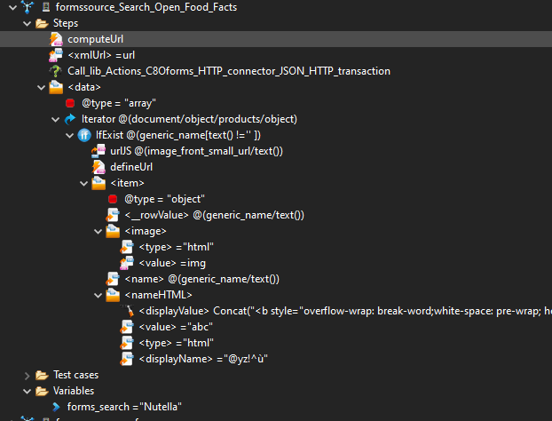

## Data sources ##
### Why do we need data sources for Form Builder ? ###

Convertigo Form Builder data source is a **powerful feature** that allows you to **get data** from external services to your end users. 

You can get any data from **any kind of services**, transform it, and then deliver it to your end users as a simple data source **to be used in the no-code environnment**. 

**Write once, use many times**: Once you have created a data source, it can be used by any of your users to create powerful **No-code applications in a few clicks**. 

### Creating a data source for Form Builder ###

Data sources, are created with Convertigo’s low-code platform [Convertigo studio](https://www.convertigo.com/mobile-application-development-studio/). Download it from [there](https://github.com/convertigo/convertigo/releases).

To do so, you will have to create a [Sequence](https://www.convertigo.com/documentation/develop/reference-manual/convertigo-objects/sequencer/generic-sequence/). A Sequence defines and orchestrates a series of actions in a low-code way.

#### Make a data source sequence ready for Convertigo Form Builder ####
You can find a project with some examples [here](https://github.com/convertigo/c8oprj-lib-actions-c8oforms).

Currently they are two components that supports data source:
* Grids
* Selects
##### Expose a sequence as a data source #####

A sequence name has to be **prefixed** by “formssource_” to be visible as a source from Convertigo Form Builder.

##### Expose a variable as an option of the data source #####
If you want to expose some sequence's variables, you'll have to prefix their names by "forms_".
Thoses variables will be seen as **options** by the no-code maker. 

Actually, they are two types of variables: 
* Standards ones: They offers to the user the possibility to be filled by typing text and using values of other components of the forms in a no-code way. Advanced users can also use JavaScript expressions.
* HTML ones: They offer to the user the possibility to use a WYSIWYG editor to format theirs contents in a no-code way. They will be able to drag and drop components of the form to use their value. The sequence will receive in this variable an HTML string value.

By default variable's type are standard, if you want to use HTML ones enter "html" value into Descripiton field of Properties of the variable 

##### Documentation and internationalization for the users of data sources #####

You can provide documentation using the comment field of the Sequence, or of the variable. This documentation will be displayed within the no-code studio to the app maker. 

You must specify the type of component supported by your data source using the types fields. See below

If you want to internationalize your comments you can follow the following syntax: 

```JSON
{
        // English support
        "en": {
            "displayName": "Fake list of company employees",
            "comment": "Returns a fake list of company employees"
        },
        // French support
        "fr": {
            "displayName": "Fausse liste des collaborateurs de l'entreprise",
            "comment": "Renvoi une fausse liste des collaborateurs de l'entreprise"
        },
        // Spanish support
        "es": {
            "displayName": "Falsa lista de los empleados de la empresa",
            "comment": "Devuelve una lista falsa de los empleados de la empresa"
        },
        // Italian support
        "it": {
            "displayName": "Falso elenco dei dipendenti dell'azienda",
            "comment": "Restituisce un falso elenco di dipendenti dell'azienda"
        },
        // Supported types 
	      "types":["select", "grid"]
}
``` 

You can use any of the [ISO 639-1](https://fr.wikipedia.org/wiki/Liste_des_codes_ISO_639-1) to tag your documentation

Depending on the language of the no-code maker user, the correct language will use to display the documentation. 

#### Data sources compatible with grids ####
Each kind of component is expecting different kind of data. To be compatible with grids, a data source sequence has to respect some specificities about  values returned.
##### structure expected #####

* **data** => *An array always named data, with 0,n items*
  * **item** => *An object containing row data with 0,n items*
    * **__rowValue** *(optional) Any object, the value to be returned by the row*
    * **first column** => *An object named as you want, with 2,n items*
      * *displayValue* => *A string with the data to be displayed*
      * *displayName* => *A string with the name of the column to be displayed*
      * *value* => *(optional) Any object, containing the value to be returned, if not set, displayValue will be returned*
      * *type* => *(optional) A string, can be "html" or "string". If html is set, the displayValue will be rendered as innerHTML.*
      * *sortingType* *(optional) A string, can be "text" or "number". Default value: "text"
      * *sortingField* *(optional) A string, can be "displayValue" or "value". Default value: "displayValue"


``` xml
<data type="array">
  <item type="object">
    <__rowValue type="any"></__rowValue> 
      <image>
        <displayValue type="string"></displayValue>
        <displayName type="string"></displayName>
        <value type="any"></value>
        <type type="string">'html' or 'string'</type>
      </image>
      <name  type="string">Your text here</name>
      <nameHTML>
        <displayValue type="string"></displayValue>
        <displayName type="string"></displayName>
        <value type="any"></value>
        <type type="string">'html' or 'string'</type>
      </nameHTML>
  </item>
</data>
```



##### an example of json structure returned by a grid data source #####
``` json
{
 "data": [
  {
    "__rowValue":"productRef123456",
    "image": {
        "displayValue": "",
        "displayName": "Logo",
        "type": "html",
        "value": "front_en.574.200.jpg"
    },
    "name": "Eau de source naturelle",

  },
  {
    "__rowValue":"productRef123456",
    "image": {
        "displayValue": "",
        "displayName":"Logo",
        "type": "html",
        "value":"front_es.225.200.jpg"
   },
   "name": "Crema de Avellanas con cacao",
  }
 ]
}
```
#### Data sources compatible with selects ####
Each kind of component is expecting different kind of data. To be compatible with selects, a data source sequence has to respect some specificities about values returned, and about some variables.

##### structure expected #####

* **value** => *An array always named value, with 0,n strings*

or 

* **value** => *An array always named value, with 0,n items*
  * **item** => *An object containing data with 2 items*
    * *displayValue* => *A string with the data to be displayed*
    * *value* => *(optional) Any object, containing the value to be returned, if not set, displayValue will be returned*

##### forms_filter variable #####

This variable contains the value of the filter typed by the user; you'll have to use it to filter your returned values 
## Actions ##

### Why do we need actions for Form Builder ? ###

Convertigo Form Builder actions is a **powerful feature** that allows you to **perform any actions** from external services to your end users. 

You can perform any **any kind of actions**, such as sending emails or inserting data into databases for example, and then deliver it to your end users as a simple submit action **to be used in the no-code environnment**. 

**Write once, use many times**: Once you have created an action, it can be used by any of your users to create powerful **No-code applications in a few clicks**.
### Creating a data source for Form Builder ###

Actions, are created with Convertigo’s low-code platform [Convertigo studio](https://www.convertigo.com/mobile-application-development-studio/). Download it from [there](https://github.com/convertigo/convertigo/releases).

To do so, you will have to create a [Sequence](https://www.convertigo.com/documentation/develop/reference-manual/convertigo-objects/sequencer/generic-sequence/). A Sequence defines and orchestrates a series of actions in a low-code way.

#### Make a submit action sequence ready for Convertigo Form Builder ####
You can find a project with some examples [here](https://github.com/convertigo/c8oprj-lib-actions-c8oforms)
##### Expose a sequence as a submit action #####

A sequence name has to be **prefixed** by “forms_” to be visible as a submit action from Convertigo Form Builder

##### Expose a variable as an option of the submit action #####
If you want to expose some sequence's variables, you'll have to prefix their names by "forms_".
Thoses variables will be seen as **options** by the no-code maker. 

Actually, they are two types of variables: 
* Standards ones: They offers to the user the possibility to be filled by typing text and using values of other components of the forms in a no-code way. Advanced users can also use JavaScript expressions.
* HTML ones: They offer to the user the possibility to use a WYSIWYG editor to format theirs contents in a no-code way. They will be able to drag and drop components of the form to use their value. The sequence will receive in this variable an HTML string value.

By default variable's type are standard, if you want to use HTML ones enter "html" value into Descripiton field of Properties of the variable 

##### Documentation and internationalization for the users of submit actions #####

You can provide documentation using the comment field of the Sequence, or of the variable. This documentation will be displayed within the no-code studio to the app maker. 
If you want to internationalize your comments you can follow the following syntax: 

```javascript
{
    "en":{ /* for English support */
        "displayName": "<p>Email body</p>",
        "comment": "<div>Email body (short string). || <i>(optional)</i></div>"
    },
    "fr":{ /* for French support */
        "displayName": "<p>Corps de l'e-mail</p>",
        "comment": "<div>Corps de l'e-mail (chaîne courte). || <i>(optionnel)</i></div>"
    },
    "es":{ /* for Spanish support */
        "displayName": "<p>Cuerpo del correo</p>",
        "comment": "<div>Cuerpo del correo electrónico (cadena corta). || <i>(opcional)</i></div>"
    },
    "it":{ /* for Italian support */
        "displayName": "<p>Corpo dell'email</p>",
        "comment": "<div>Corpo dell'email (stringa breve). || <i>(facoltativo)</div>"
    }
}
```
 

You can use any of the [ISO 639-1](https://fr.wikipedia.org/wiki/Liste_des_codes_ISO_639-1) to tag your documentation

Depending on the language of the no-code maker user, the correct language will use to display the documentation. 

##### Structure of the Sequence ####

Two others variables will be sent to your sequences:
* doc: The JSON document containing the **response** of the form
* originalDoc: The JSON document containing the **original document** of the form
