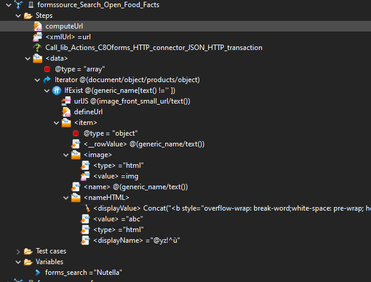

## Data sources ##

### Why use data sources in No-Code Forms? ###

A data source lets a No-Code Forms application retrieve data from a Convertigo sequence. The sequence can call any connector or external service, transform its response, and expose the resulting data through the No-Code Studio.

**Write once, use many times:** once published, the same data source can be configured and reused by multiple no-code makers and applications.

### Creating a data source for No-Code Forms ###

Data sources are created with [Convertigo Studio](https://www.convertigo.com/mobile-application-development-studio/), available from the [Convertigo releases page](https://github.com/convertigo/convertigo/releases).

Create a [Sequence](https://www.convertigo.com/documentation/develop/reference-manual/convertigo-objects/sequencer/generic-sequence/) that retrieves and transforms the data. No-Code Forms discovers the sequence and its configurable variables from their names and metadata.

Example projects include [C8Oforms actions](https://github.com/convertigo/c8oprj-lib-actions-c8oforms) and the [Baserow data source](https://github.com/convertigo/c8oprj-lib-baserow).

#### Expose a sequence as a data source ####

A sequence name must be prefixed with `formssource_` to appear in the No-Code Studio data source selector. For example: `formssource_Table_Sites`.

The sequence Comment can contain a JSON object whose `types` property restricts the components for which the source is proposed. For a grid-only source, use:

```json
{
  "types": ["grid"]
}
```

Omit `types` to make the source available to every compatible component, or list each supported component type, for example `["select", "grid"]`.

The Studio currently discovers sources for the following component types:

| `types` value | Components |
| --- | --- |
| `grid` | Grid and gallery |
| `select` | Select list |
| `checkbox` | Checkbox list |
| `radio` | Radio-button list |
| `checkbox_group` | Checkbox group |
| `radio_group` | Radio-button group |
| `chart` | Chart |
| `map` | Map |

Gallery components use the `grid` source contract. Only declare component types for which the sequence returns the expected structure.

#### Expose a sequence variable as a data source option ####

Prefix a requestable variable name with `forms_` to expose it as an option in the No-Code Studio. Variables without this prefix are not displayed as source options.

The variable **Description** property controls the editor presented to the no-code maker:

| Description | Studio behavior |
| --- | --- |
| Empty or `text` | Text, component value, or JavaScript expression |
| `html` | Rich-text editor that returns an HTML string |
| `filter` | Dynamic filter builder |
| `sort` | Sort-order builder |
| `distinct_column` | Distinct-column option |
| `group_by_columns` | Group-by option |
| `group_by_aggregations` | Aggregation option |
| `configure=<project>/<page>` | Opens a custom configuration page supplied by another Convertigo project |

The **Comment** property supplies the visible name and help text. It does not activate an editor.

#### Add filter, sort, distinct, group-by, and aggregation options ####

Advanced query controls are declarative. They are not enabled automatically merely because a sequence is used by an AG Grid component. Declare only the capabilities implemented by the sequence backend.

The variable names below are the recommended convention used by the native Baserow source. The `forms_` prefix makes the variable discoverable; the Description value is what activates the corresponding Studio option.

| Capability | Recommended variable | Description | Value received by the sequence |
| --- | --- | --- | --- |
| Filter | `forms_tableFilter` | `filter` | JSON filter definition |
| Sort | `forms_tableSort` | `sort` | JSON sort definition |
| Distinct columns | `forms_tableDistinct` | `distinct_column` | Comma-separated column names |
| Group by | `forms_tableGroupBy` | `group_by_columns` | Comma-separated column names |
| Aggregations | `forms_tableAggregations` | `group_by_aggregations` | Comma-separated aggregation expressions |

Names such as `__filter`, `__sort`, `__groupBy`, and `__aggregations` are not automatically discovered. Custom `forms_` names can be used, but the backend must read the same names and the Description values must match the table above.

The filter builder sends a JSON object with a global `AND` or `OR` mode and a list of conditions:

```json
{
  "mode": "AND",
  "filters": [
    {
      "field": "Status",
      "op": "equal",
      "value": "Open"
    }
  ]
}
```

Filter groups use the same `{ "mode", "filters" }` structure and can appear inside the `filters` array. A condition can also contain Studio metadata such as `fieldType`, `fieldMeta`, or `selectOptions`; a custom backend can ignore metadata it does not need.

The filter builder can emit the following operators. The available subset depends on the field metadata returned in model mode:

| Operator | Meaning |
| --- | --- |
| `equal` or `equals` | Equal to |
| `not_equal` or `different` | Different from |
| `minus` | Less than |
| `minusequals` | Less than or equal to |
| `greater` | Greater than |
| `greaterequals` | Greater than or equal to |
| `among_following` | Included in the supplied values |
| `out_following` | Not included in the supplied values |
| `contains` | Contains the supplied value |
| `not_contains` | Does not contain the supplied value |
| `is_empty` | Has no value |
| `is_filled` | Has a value |
| `contains_a_file` | Contains a file |
| `does_not_contain_file` | Does not contain a file |
| `contains_multiple_files` | Contains multiple files |

Backends should reject unsupported operators instead of silently treating them as another operation.

The sort builder sends:

```json
{
  "sorts": [
    {
      "name": "Date",
      "order": "desc"
    }
  ]
}
```

The other options are strings:

- Distinct columns: `Country,City`
- Group-by columns: `Service,Region`
- Aggregations: `count,sum:Amount,avg:Amount,min:Date,max:Score`

`count`, `sum`, `avg`, `min`, and `max` are the conventions implemented by the native Baserow sequence. A custom source must implement and document the operations it accepts. If Group by is configured, it is recommended to ignore Distinct and to default to `count` when no aggregation is supplied.

#### Return the data model used by the editors ####

Add a technical requestable variable named `model`. Unlike maker-facing options, it does not use the `forms_` prefix.

When the Studio needs to populate the filter and sort editors, it calls the selected source with `model=true`. In this mode, return a `data` array containing one representative row with every field that may be filtered or sorted. Do not let the current filter, grouping, or pagination hide fields from this model response.

Column objects in the model row can provide the following optional metadata:

- `displayName`: label displayed in the Studio
- `cType` or `type`: field type used to propose appropriate operators
- `filterHide: true`: excludes the field from the filter builder
- `sortHide: true`: excludes the field from the sort builder
- `filterCompletion`: custom list of filter operators

The native Baserow source additionally supports `model=all_columns`. This value is specific to its current integration; custom sources must support `model=true` and should return their complete model for that call.

#### Process query options in the backend ####

Requestable variables usually reach the sequence as strings. A Sequence JavaScript step can parse the JSON options as follows:

```javascript
function parseJsonInput(value, fallback) {
  if (value == null || String(value) === "") {
    return fallback;
  }
  return JSON.parse(String(value));
}

function parseCsvInput(value) {
  if (value == null || String(value) === "") {
    return [];
  }
  return String(value).split(",").map(function (item) {
    return item.trim();
  }).filter(function (item) {
    return item !== "";
  });
}

var filterDefinition = parseJsonInput(forms_tableFilter, {
  mode: "AND",
  filters: []
});
var sortDefinition = parseJsonInput(forms_tableSort, {
  sorts: []
});
var distinctColumns = parseCsvInput(forms_tableDistinct);
var groupByColumns = parseCsvInput(forms_tableGroupBy);
var aggregationExpressions = parseCsvInput(forms_tableAggregations);
var modelValue = String(model);
var modelMode = model === true || modelValue === "true" || modelValue === "all_columns";
```

Translate these definitions into the connector request or a parameterized database query before retrieving the rows. Whitelist accepted field names, sort directions, operators, and aggregation functions, and bind values as parameters. Do not concatenate values received from the Studio into SQL or connector expressions.

Applying the operations in the database or remote connector provides the expected performance benefit. Fetching every row and then filtering it in JavaScript does not.

These controls do not automatically enable the AG Grid server-side row model. No-Code Forms evaluates the sequence with its configured variables; the sequence remains responsible for paging, limiting the result set, and translating the options into an efficient backend request. If paging parameters are required, expose additional documented `forms_` variables or enforce safe backend limits.

##### Minimal grid source implementation ####

A minimal grid sequence can use the following steps:

1. Declare the required `forms_` variables and the technical `model` variable.
2. Add an **Input Variables** step.
3. Parse and validate the query options in a JavaScript step.
4. Execute a parameterized connector or database request.
5. Build a result object named, for example, `sourceResult`.
6. Add a **JSON to XML** step using `sourceResult` as its expression.

The final JavaScript step can shape the model response and the regular rows as follows. In this example, `connectorRows` represents rows already filtered, sorted, grouped, and limited by the backend:

```javascript
var sourceResult;

if (modelMode) {
  sourceResult = {
    data: [{
      Site: {
        displayName: "Site",
        cType: "text",
        displayValue: ""
      },
      Capacity: {
        displayName: "Capacity",
        cType: "number",
        displayValue: 0
      }
    }]
  };
} else {
  sourceResult = {
    data: connectorRows.map(function (row) {
      return {
        __rowValue: row.id,
        Site: row.site,
        Capacity: row.capacity
      };
    })
  };
}
```

##### Security requirements ####

Source sequences are backend requestables. Do not rely on the Studio configuration to enforce security:

- Check the authenticated user and their permissions in the sequence.
- Whitelist field names, operators, sort directions, and aggregation functions.
- Bind values through connector parameters or prepared statements.
- Apply maximum result and execution-time limits.
- Do not expose credentials or secrets as maker-facing `forms_` variables.

#### Documentation and internationalization for data source users ####

Use the Comment property of the Sequence and its variables to provide the name and help text displayed to the no-code maker. The Comment can be a localized JSON object:

```json
{
  "en": {
    "displayName": "Company employees",
    "comment": "Returns the company's employees"
  },
  "fr": {
    "displayName": "Collaborateurs de l'entreprise",
    "comment": "Renvoie les collaborateurs de l'entreprise"
  },
  "es": {
    "displayName": "Empleados de la empresa",
    "comment": "Devuelve los empleados de la empresa"
  },
  "it": {
    "displayName": "Dipendenti dell'azienda",
    "comment": "Restituisce i dipendenti dell'azienda"
  },
  "types": ["select", "grid"]
}
```

Use an [ISO 639-1 language code](https://en.wikipedia.org/wiki/List_of_ISO_639_language_codes) for each translation.

The Studio displays the translation matching the no-code maker's language.

#### Data sources compatible with grids and galleries ####

A grid or gallery data source must return a top-level array named `data`.

##### Expected structure ####

- **data**: an array containing zero or more row objects
  - **item**: an object containing the row's columns
    - **__rowValue** (optional): value returned when the row is selected
    - **column name**: either a scalar value or an object with cell metadata
      - **displayValue**: value displayed in the grid
      - **displayName**: column label
      - **value** (optional): underlying value returned by the cell; defaults to `displayValue`
      - **type** (optional): `html` or `string`; HTML values are rendered as inner HTML
      - **cType** (optional): field type used by the filter and sort editors
      - **sortingType** (optional): `text` or `number`; defaults to `text`
      - **sortingField** (optional): `displayValue` or `value`; defaults to `displayValue`

```xml
<data type="array">
  <item type="object">
    <__rowValue type="string">productRef123456</__rowValue>
    <image type="object">
      <displayValue type="string">&lt;img src="..." /&gt;</displayValue>
      <displayName type="string">Logo</displayName>
      <value type="string">front_en.574.200.jpg</value>
      <type type="string">html</type>
    </image>
    <name type="string">Spring water</name>
  </item>
</data>
```



##### JSON response example ####

```json
{
  "data": [
    {
      "__rowValue": "productRef123456",
      "image": {
        "displayValue": "",
        "displayName": "Logo",
        "type": "html",
        "value": "front_en.574.200.jpg"
      },
      "name": "Spring water"
    },
    {
      "__rowValue": "productRef789012",
      "image": {
        "displayValue": "",
        "displayName": "Logo",
        "type": "html",
        "value": "front_es.225.200.jpg"
      },
      "name": "Hazelnut cocoa spread"
    }
  ]
}
```

#### Data sources compatible with choice components ####

Select, checkbox, radio, checkbox-group, and radio-group sources must return a top-level array named `value`. It can contain strings directly or objects with:

- `displayValue`: value displayed to the user
- `value` (optional): underlying value returned by the option; defaults to `displayValue`

##### `forms_filter` variable ####

For components with built-in search, `forms_filter` receives the text entered by the end user. Use it to restrict the returned options.

This select-specific live-search variable is different from an advanced grid variable whose Description is `filter`, such as `forms_tableFilter`.

## Submit actions ##

### Why use submit actions in No-Code Forms? ###

A submit action lets a form or flow call a Convertigo sequence. The sequence can send notifications, write to a database, generate a document, update the current response, or orchestrate any other authorized backend operation.

Once published, the same action can be configured and reused by multiple no-code makers. Example implementations are available in the [C8Oforms actions project](https://github.com/convertigo/c8oprj-lib-actions-c8oforms).

### Creating a submit action ###

Create the action as a regular Convertigo [Sequence](https://www.convertigo.com/documentation/develop/reference-manual/convertigo-objects/sequencer/generic-sequence/).

#### Expose a sequence as a submit action ####

The sequence name must be prefixed with `forms_` to appear in the No-Code Studio action selector. For example: `forms_notify_response`.

#### Expose maker-facing action variables ####

Prefix a requestable variable name with `forms_` to display it in the action configuration. The variable Description controls the editor:

| Description | Studio behavior | Value received by the sequence |
| --- | --- | --- |
| Empty or `text` | Text, component value, or JavaScript expression | String or evaluated value |
| `html` | Rich-text editor | HTML string |
| `boolean` | Boolean switch | Boolean-like value |
| `file` | File stored with the form configuration | Temporary server file path |
| `configure=<project>/<page>` | Custom configuration page | Value produced by that page |

Use the variable Comment for its localized display name and help text. The localized JSON format is the same as in [the data source documentation above](#documentation-and-internationalization-for-data-source-users).

Do not use a `forms_` variable for passwords, API keys, or other secrets. Store secrets in Convertigo symbols or another server-side secret store.

#### Technical variables supplied during execution ####

Technical variables do not use the `forms_` prefix and are not displayed to the no-code maker. Declare the variables needed by the sequence:

| Variable | Content |
| --- | --- |
| `doc` | Latest stored version of the current response document |
| `originalDoc` | Published form definition associated with the response |
| `currentAction` | Current action configuration as a JSON string |
| `_c8o_timezone_offset` | Respondent's local UTC offset in milliseconds |

`doc` commonly contains the response identifier, form identifier, version, timestamp, and a `resp` object holding the submitted field values. Before each action, No-Code Forms reloads the latest stored response, so an action can see changes persisted by a preceding action.

`doc` and `originalDoc` are JSON documents converted to XML/DOM values for the target sequence; they are not plain JSON strings. A common sequence pattern is:

1. Add an **Input Variables** step.
2. Add a **JSON Source** step targeting `./doc` or `./originalDoc`.
3. Process the resulting JavaScript object in the following steps.

The exact response structure depends on the form components. Backend code should read fields by their technical names and tolerate optional metadata.

#### Handle `file` action variables ####

When a requestable variable has the Description `file`, the no-code maker can provide a file with the action configuration. At execution time, No-Code Forms:

1. Reads the attachment stored with the form.
2. Copies it to a temporary server file.
3. Passes the temporary path to the action variable.
4. Deletes the temporary file after the sequence returns.

The sequence must read the file during its execution and must not persist or reuse the temporary path. Validate the actual content, MIME type, and size; do not trust the filename or extension alone.

Files uploaded by respondents are referenced from the corresponding entries in `doc.resp`. They are separate from a static action variable whose Description is `file`.

#### Use an action result in a flow ####

Standard submit actions are executed synchronously and in order. The regular Convertigo sequence output becomes the action value in No-Code Forms and can be referenced by later flow elements or dependent sources.

No additional result wrapper is required in the custom sequence. Return a normal Convertigo sequence document with stable, documented field names. If the action modifies the stored response, persist the modification before returning so that the following action receives the updated `doc`.

#### Secure submit actions ####

Submit-action sequences are backend requestables and receive user-controlled form data:

- Check the authenticated user and authorization rules in the sequence.
- Validate every maker-configured variable and every value read from `doc.resp`.
- Use parameterized connector or database operations.
- Keep credentials server-side.
- Apply file-size, execution-time, and downstream-request limits.
- Return explicit errors without exposing credentials, filesystem locations, or internal stack traces.
