This chapter describes you how to use Convertigo backend objects to connect your data.

## Connecting to Data

### Connect to Rest Web Services

Convertigo features the HTTP Connector able to connect and consume Rest API Web Services. 
To create a new REST project, click New > File > Project... > Convertigo Projects > **REST Empty Web service**. This template will do most of the work, but you can also manually create an HTTP Connector in any existing project by Right Click on project  > New > Connector > HTTP Connector. The Connector will be placed in the Connectors folder.


Choose a name wisely ;)


You have the possibility to give the HTTP connector a name


In next screen, set the address of the Rest Web Service to connect to. (Do not type http:// or https://) as this is automatically computed according to the SSL setting).


Last screen is a summary of all entered parameters for the Connector. Click **Finish**


The project is created in the Studio, in the **Projects** view


There are two ways of creating Connector and Transactions. If the Web Service has a YAML or JSWON openAPI definition (Swagger definition) you can import it and transactions will be automatically created or else you can manually set up the transactions.

#### __Manual transactions__

Right-click the Connector or its **Transactions** folder, then select New > Transaction


Depending on the target Rest Web Service choose the appropriate transaction type:
* **XML HTTP Transaction** will consume XML based REST Webservices (Data returned by the web services in XML format), mostly for XML/RPC type of web services
* **JSON HTTP Transaction** will consume jSON based REST Webservices (Data returned by the web services in jSON format), mostly for standard RESTful web services available today.
* **Download HTTP Transaction** will consume Binary based REST Webservices (Data returned by the web services in Binary format), mostly for downloading data in Binary format.
* **HTTP Transaction** will consume a REST based on unknown format. The data will be returned as raw data, you will have to parse by hand.


Give the transaction a name, add built-in and/or custom variables (they can be edited or added later). These variables will enable you to invoke the transactions with a given BODY, ContentType or any other POST or GET element in the HTTP Request.


Once the Transaction is created, you can right-click the transaction > Execute or press F5 key to execute transaction to test it and get results.

Also you can add a **Test Case** to it (Right Click o Transaction->New->Test Case) and set values in Variables to test your Transaction with a Given set of Input Variables. To set the value in a Variable, give the value in the **Default Value** Test Case variable's property.


#### __Importing REST WS schema__

Right-click your project > **Import REST WS reference**


Enter URL of the REST schema or browse a local file to import


API methods are automatically created as transactions of the corresponding type


You can easily create the **Call Transaction** Step by dragging and dropping the transaction a sequence with **CTRL key** (Windows) or **Command KEY** (Mac) pressed


To update transaction schema to be used in Sequence **Source picker**, execute the transaction at least once, right-click it and select **Update schema from current connector data**


Double-click your **Call Transaction** Step to refresh and display schema in the Source picker tab


### Connect to SOAP Web Services

Convertigo HTTP connector is able to connect to SOAP Web Services (XML messaging) through the import of a WSDL file or url.

To create a new SOAP project, click New > File > Project... > Convertigo Projects > **SOAP Web service**.


Give your project a name


Next screen will ask for an URL or a file to the distant SOAP Web Service WSDL.


The HTTP Connector is automatically created and named. **XML HTTP Transaction** are also automatically created and named by the SOAP method name and prefixed by a '**C**'


You can right-click the transaction > Execute or press F5 key to execute transaction to test it and get results. Left Panel is the Raw response of the WS and right panel is the XML or JSON response as seen in the transaction itself


You can test the other WS methods that require variable values using Test Cases.


You can easily create the **Call Transaction** Step by dragging and dropping the transaction a sequence with **CTRL key** (Windows) or **Command Key** (Mac) pressed


No need to update the transaction schema for the Sequence Source Picker, it was automatically created when the WSDL was imported.


In the Project Explorer view, you will see the SOAP templates in the **soap-templates** folder. This can be edited at your convinience (variable name, etc...).


### Connect to SQL Databases

The SQL Connector is able to connect to different Database Servers:  

| Supported Database   | Driver                                                           |
|----------------------|------------------------------------------------------------------|
| mySQL                | com.mysql.jdbc.Driver / com.mysql.cj.jdbc.Driver (V8+)           |
| MariaDB              | org.mariadb.jdbc.Driver                                          |
| Microsoft SQL Server | net.sourceforge.jtds.jdbc.Driver                                 |
| Oracle               | oracle.jdbc.driver.OracleDriver                                  |
| PostgreSQL           | org.postgresql.Driver                                            |
| HSQLDB               | org.hsqldb.jdbcDriver                                            |
| IBM DB2 on AS/400    | com.ibm.as400.access.AS400JDBCDriver                             |
| IBM DB2              | com.ibm.db2.jcc.DB2Driver                                        |  
| ODBC Bridge          | sun.jdbc.odbc.JdbcOdbcDriver                                     |


**JNDI** Database access is also available. In This case The database has to be referenced in the Application Server definition. This is only to be used in the case Convertigo Servers are deployed in J2EE Application Servers such as IBM WebSphere.

You can also add any other JDBC driver dynamically by adding the driver's **JAR** file in the **libs** folder of your project. When you project will be deployed to the Convertigo server, it will be usable from your project. You will just have to know explicitly the driver URL to access it.

#### Create a SQL Connector based project
To create a new SQL project, click New > File > Project... > Convertigo Projects > **SQL project**


Choose a name for the project


You have the possibility to give the SQL connector a name


In next screen, choose the **JDBC driver** for your database connection and enter **JDBC URL** from proposed template. Fill in **Username** and **Password**, if needed. You can test the connection to the database using the **Test connection** button.


The project is created in the Studio, in the **Projects** view


To create a new SQL query, create a new SQL transaction. Right-click the Connector or its **Transactions** folder, then select New > Transaction


There is currently only one transaction type, choose **SQL transaction**


In the final wizard page, you have the possibility to write your SQL query. Enclose transaction variables (dynamic values) with brackets **{my_variable}**, this will also automatically creates the variables.

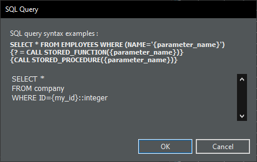

**my_id** transaction variable has been automatically created in the SQL transaction. Convertigo variables are String based variables. Some Database Servers need the data to be casted to the correct type (**::integer** for PostgreSQL query, for example)


If you double-click the SQL connector this will open a Tab with the Connector buttons and the transaction response data.  
If you haven't checked already, there is a button to test connection to your database.


Right-click the transaction > Execute or press F5 key to execute transaction and get result


If your transaction requires dynamic data, use Test cases as below


You can easily create the **Call Transaction** Step by dragging and dropping the transaction a sequence with CTRL key down


To update transaction schema to be used in Sequence **Source picker**, execute the transaction at least once, right-click it and select **Update schema from current connector data** or **Update schema from transaction definition**


Double-click your **Call Transaction** Step to refresh and display schema in the Source picker tab


### Connect to NoSQL Databases

### Connect to SAP NetWeaver Systems

### Understanding Data schemas

In Convertigo, all data coming from connectors are described by **Schemas**. This description is based on the XML Schema [https://www.w3schools.com/xml/schema_intro.asp](https://www.w3schools.com/xml/schema_intro.asp), and is automatically handled by Convertigo Studio. 

**Schemas** Can be displayed in the **Schema View**

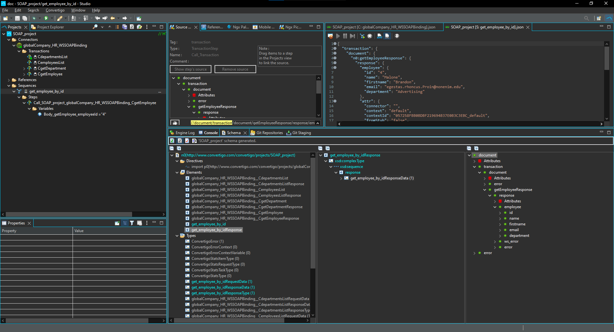

By Default, Convertigo is not aware of the Structure (Schema) of data retrieved from a Connector, except when :

* The Connectors have been created from some Structured definition files (Import SOAP or REST YAML/JSON Swagger web Services)
* The Connector has been Created by importing SAP BAPI Transactions
  
The **Schemas** Are used in various parts  of Convertigo Studio and mainly in all **Source Pickers** to display the Structure of the data to bind from Step to Step or to bind from a Service to a FrontEnd UI.

This is why it is important to describe the Data Schema of Connector's transactions to Convertigo. This easy to do as Convertigo provides 2 commands to generate Schemas:

* Execute a Transaction to retrieve some data (F5 when the Transaction is selected), Right Click on a Transaction, and use the **Update Schema from Current Connector data**. This will use the current data displayed in the connector as model to generate a response Schema for this this Transaction. The response schema will be seen in the Schema view as **&lt;ConnectorName&gt;_&lt;TransactionName&gt;_ResponseData**.

    {{site.data.alerts.note}}
    Note that transaction's request data schemas are Automatically generated by Convertigo as &lt;ConnectorName&gt;_&lt;TransactionName&gt;_RequestData.
    {{site.data.alerts.end}}

* You can also use the **Update Schema from Transaction definition** command. This will only work on Connectors where Convertigo can introspect the underlying data models, for example SQL Connector transactions.

Once the **Schemas** are generated, you will be be able to explore all the data structures in the **Schema View** and to use them in the **Source Picker** (back end data binding) and the **Ngx Picker** (Front End data binding).

Note also that Schemas for **Sequences** are automatically generated by Convertigo by exploring the **Sequence** Data structure steps. You will find them in the **Schema** view as **&lt;SequenceName&gt;_RequestData** and **&lt;SequenceName&gt;_ResponseData**

## Building Backend Services

In Convertigo Back end services are called **Sequences** You can have as many **Sequences** in your projects, when called each Sequence will perform a backend flow executed on the Convertigo servers. Sequences can call Transactions to retrieve  or push data to connectors, perform data structure transformations and compute business logic.

Sequences building blocks are called **Steps**. Each step is executed one other the other in Sequence (This is why we call this a Sequence...). Some steps will build data structures (JSON and XML Steps), some will control the flow of execution (Flow Control Steps) and others will handle miscellaneous tasks like authentications, session management and others.

Sequences can have Input variables that will be used during the execution to provide data used for flow control or for pushing this data to connectors. In a Sequence all variables are Strings, as the connectors are responsible for typing the data to the correct format.

Sequences can call Connector's transactions and of course other Sequences (Sub Sequences) from the same project or from any other project in your workspace. This enables the concept of Sequences libraries projects providing sequences performing various tasks. By convention a library project is named as **lib_&lt;MyLibraryProject&gt;**

### Calling Transactions

One of the most commons tasks performed by a **Sequence** is to call a Connector's transaction. You can do this by using the [Call Transaction Step](../../reference-manual/convertigo-objects/sequencer/steps/convertigo-request-steps/call-transaction/)


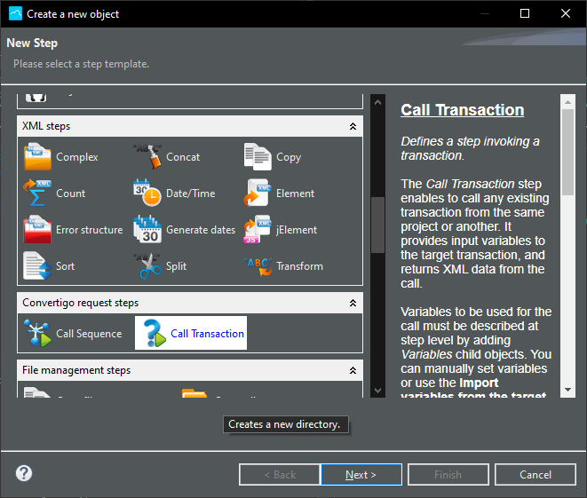


A Sequence can call a transaction from its own project or form any Other project installed in your workspace. When executed the [Call Transaction Step](../../reference-manual/convertigo-objects/sequencer/steps/convertigo-request-steps/call-transaction/) Step will provide the data returned by the Connector as a **Source** to any other following step in the Sequence.

### Understanding the "Source" concept

**Sources** are a key concept in Convertigo. The basic idea is that each **Step** can provide data to the following steps in the execution flow. So, a given step can 'Source' some data from an other step previously executed.

The **Source Picker Tool** will display the data structure tree provided by a step when you right click on a step ->Show in Picker

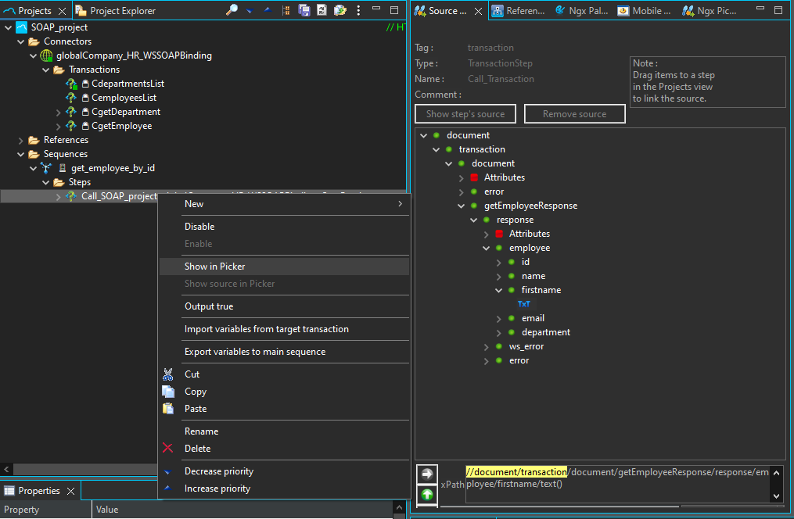

If you want to link (We can also say 'Source') data provided by a step to an other Step, you will just have to Drag & Drop the wanted tree element **TXT** to the destination steps.

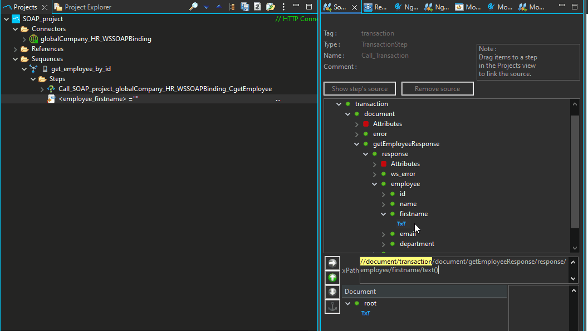 

An other way to do this is to use the **Source** property of a Step and click on the [...] button to open source selector window.

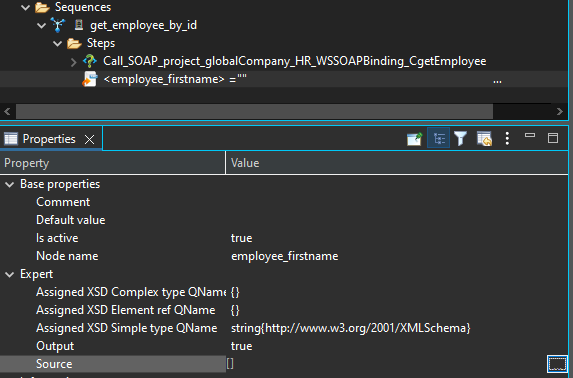

Select the Step from where you want to 'Source' data from. (All Red Steps can not be sourced as they will be executed after your step) And pick in the tree data structure the **TXT** element you want to bind to your step.

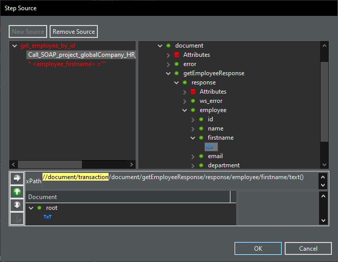

#### XPath models

**XPaths** are a way to point to the data structure elements values we will want to source. This follows a standard syntax described [here](https://www.w3schools.com/xml/xpath_syntax.asp). In most cases, the source picker will generate for the you a Valid XPath so you do not have to bother so much about this. You can find below some very common XPath Use cases:

|XPath  sample | Usage |
|--------|-------|
|/data1/data2/data3/text() | Will select the **data3** node value if there is only one **data3** occurrence in the structure or all **data3** values (concatenated) if there are several occurrences of **data3** |
|/data1/data2/data3[1]/text() | Will select all the first **data3** occurrence value |
|/data1/data2/data3[@orginalKeyName = 'MyKey']/text() | Will select the **data3** occurrence having a attribute **'originalKeyname'** equal to **'MyKey'** |
|/data1//data4/text() | Will select all **data4** node values that are under the **data1** node whatever is their tree depth |

**XPaths** are a powerful selector tools to be able to 'Source' data from any structure

### Build logic flows

Sequences can have logic flows such as If/The/else decisions, Iterators and loop or Parallel executions. The execution is based on a graphic tree as follow :
* For **If** steps, every step under a If node will be executed if the If condition matches. If not the flow will continue to steps on the same level.
* For **If / Then / Else** steps, every step under the **Then** Step will be executed if the If condition matches. If not all the steps un the **Else** will be executed. At the end the flow will continue to steps on the same level.
* For **Iterators** and **loops** all steps under an **Iterator** Step will be executed repeatedly for each Iteration. When the iterations are finished the flow will continue to the step at the same level.
* For **Parallel** steps, Each step under a **Parallel** Step will be executed at the same time. The sequence will resume to the next Step at the same level when all the Steps finished their executions.

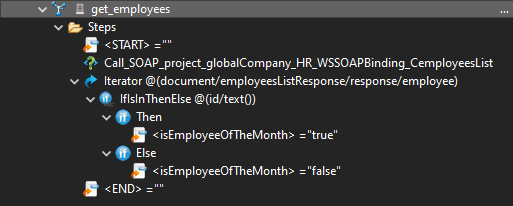

### Iterate on patterns

Sequences can use iterators or Loops Steps to perform several times step executions. The most used step for this is the [Iterator](../../reference-manual/convertigo-objects/sequencer/steps/flow-control-steps/iterator/) Step. The step's **source** property will be used to know on what occurrences the Iterator Step should loop. You can use the **Source Picker** to bind the Iterator's source to any previous step data structure holding multiple occurrences of data. for example if a **Call Transaction** Step returns this data structure :

```
{
    clients: [
        item: {
            id:"1",
            name:"test"
        },
        item: {
            id:"2",
            name:"test2"
        }
    ]
}
```

| XPath | Will Iterate on on |
|-------|---------------|
|/clients/item | All **item** objects in **clients** |
|/clients/item/name | All **name** of **item** objects in **clients** |
|//item | All **item** objects |
|/clients/item[contains(./name/text(), 'test')] | All **item** objects where the **name** field contains the 'text' string |

As you see you can use the full power of **XPath** expressions to fine tune your iteration patterns. If you remember, all Steps can be a 'Source' to other Steps. This is also true for the **Iterator** step. The step can be sourced to get current Iteration data.

This is why in any Step under an **Iterator** you can source it from the Iterator with a given XPath. for example if the Iterator iterates on **/clients/item** :

| XPath | data |
|-------|---------------|
|./id/text() | Will represent the **id** value of the current  iterated **item** in **clients** |
|./name/text() | Will represent the **name** value of the current  iterated **item** in **clients** |


### Understanding variables

Any Sequence in Convertigo can have input variables. These variables can be used all along the Sequence execution flow and passed to Subsequences or Transactions. Variables can be accessed within the Sequence in 2 ways :

* By Using the [Input Variables](../../reference-manual/convertigo-objects/sequencer/steps/others/input-variables/) step. This step is generally the  first step in a sequence and represents all the Input Variables of the sequence. Any other step can 'Source' a given variable from this step.
* The variable is also automatically inserted in the JavaScript scope of the Sequence. You can access it within any [SequenceJS](../..reference-manual/convertigo-objects/sequencer/steps/javascript-steps/sequence-js/) or within any **jXXXX** type of step such as [jIf](../../reference-manual/convertigo-objects/sequencer/steps/flow-control-steps/jif/) or [jDoWhile](../../reference-manual/convertigo-objects/sequencer/steps/flow-control-steps/jdowhile/)

Variables are not typed and are always considered as Strings. It is the Sequence (And Connector) responsibility to handle type conversions properly. For example if you a variable is passed to a SQL connector Transaction, be sure in the Transaction's SQL request to properly CAST this variable to match a give SQL table column type.

Sequences variables will also appear in the Front End builder as [CallSequence](../../reference-manual/convertigo-objects/mobile-application/components/action-components/callsequence/) Variables you will be able to bind to UI components.

### Compute data & business logic

#### Integrating JavaScript code
To write JavaScript code in a Sequence use the **Sequence JS** step. There is completion for some standard JS objects and functions.

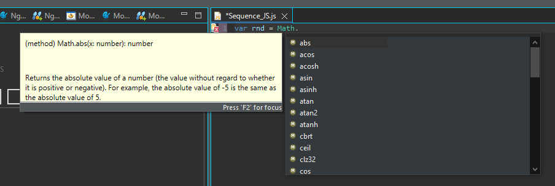

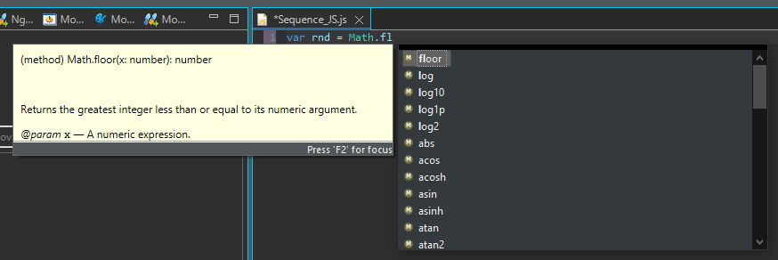

Once a JavaScript variable is declared, it is available in all JS Steps of the Sequence.
Variables of a sequence are automatically added to the JavaScript scope of the Sequence and are available as Strings by their name.  

JavaScript variables can come from JS Steps too (JSimpleSource, etc...) and are accessible in a Sequence JS step where they can be modified. You can also access JS variables and modify them directly in a jElement Step, for example, in the '**Expression**' property of the Step, but this is a one line editor. For longer script, use preferably a **Sequence JS** step.

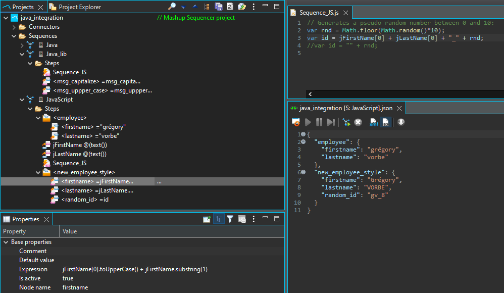

##### Calling some java code

To write Java invocation code in a Sequence use the **Sequence JS** step. You will just have to write the full package name to reference the Java class. For the standard JDK classes there is completion for the classes and methods.

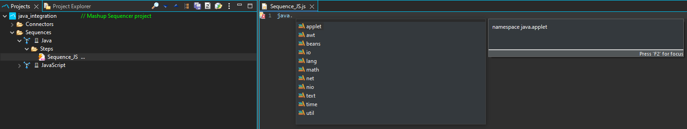

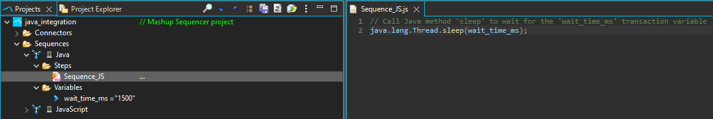

##### Using third party java libraries

To use external Java libraries, copy the classes or JAR files in a folder called '**libs**' in your project. Then, write your Java invocation code in a **Sequence JS** step. There will be no completion though. You will just have to write the full package name prefixed with the word '**Packages**'.

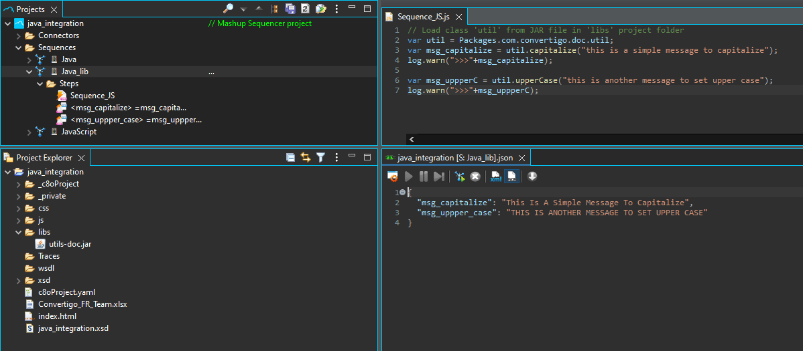

Often, to display and use properly variables data, you will have to convert them to Strings. To do so, just add an empty string to it (empty double quotes).

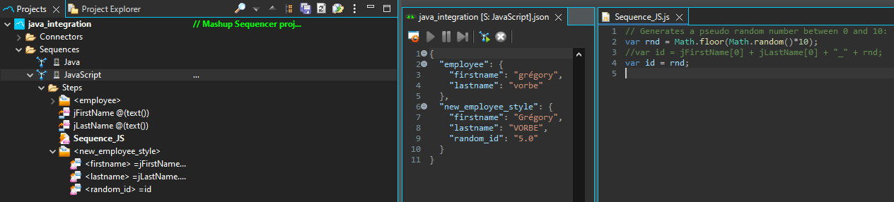

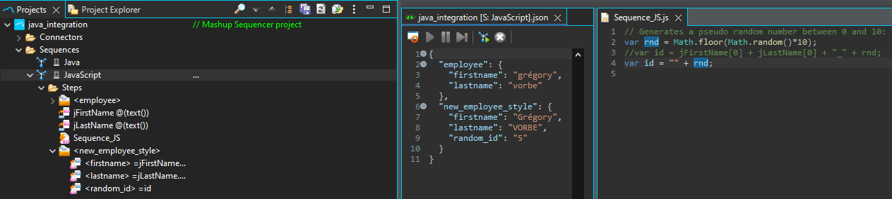

##### Using third party JavaScript libraries

To use an external JS library, copy the JS file in your project and in a **Sequence JS** Step use function '**include("<path_to_js_file>")**' to load file. This will automatically eval script in the Sequence JS scope and you can use it in a **Sequence JS** Step or in **JS element** Steps.

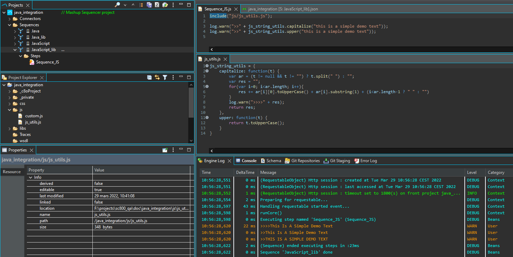
### Reading & Writing data files
Convertigo has different Steps to Read or Write data files from different formats (XML, CSV, JSON). You can also write your own data file reader/writer in a Sequence JS step using Java.

#### Read JSON Step
Use the [Read JSON](../../reference-manual/convertigo-objects/sequencer/steps/file-management-steps/read-json/) Step to load data from a JSON file.
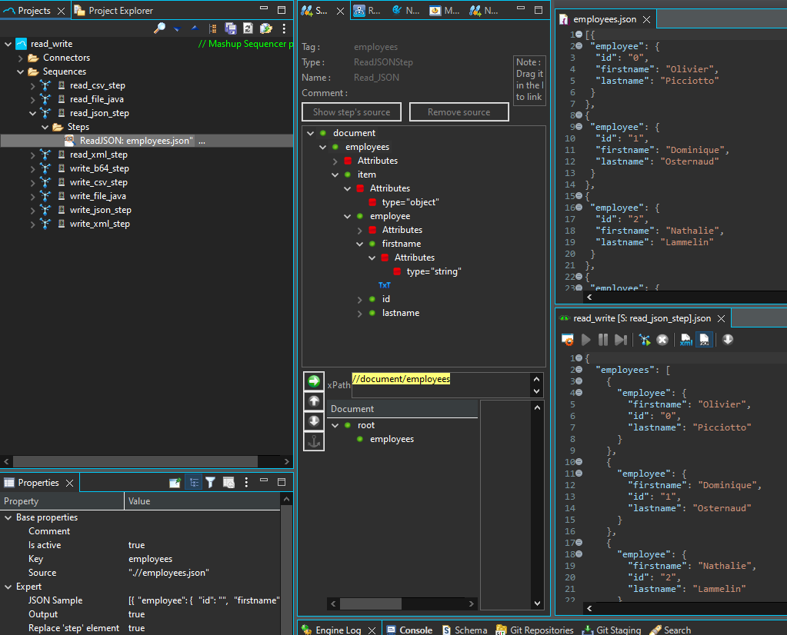

| Property | Description |
|----------|-------------|
| **Key**      | Fill this property with a value for the parent object. |
| **Source**   | This property is a Javascript field to fill with a file path. I can be an **absolute** path or a **relative** path using **./** (relative to the workspace folder) or **.//** (relative to the project folder) |

#### Write JSON Step
Use the [Write JSON](../../reference-manual/convertigo-objects/sequencer/steps/file-management-steps/write-json/) Step to write data to a JSON file.
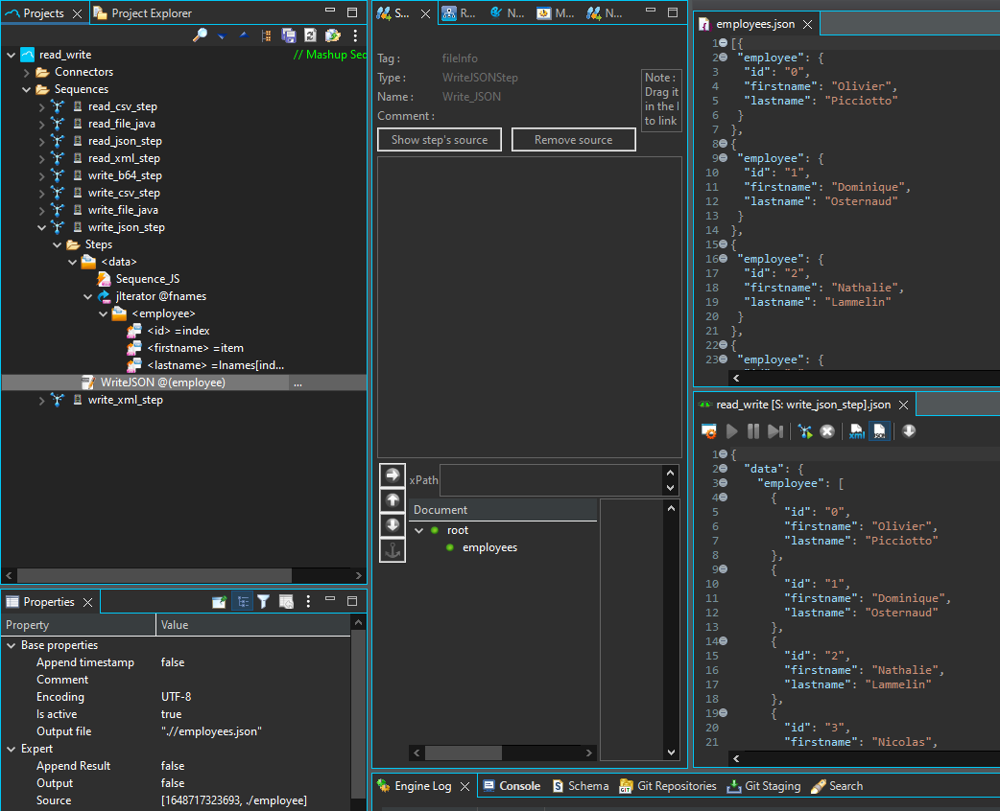

| Property | Description |
|----------|-------------|
| **Encoding**      | Set the **Encoding** property with a value for the charset encoding (ISO-8859-1, UTF-8, ...). |
|   **Output file**     | This property is a Javascript field to fill with a file path. I can be an **absolute** path or a **relative** path using **./** (relative to the workspace folder) or **.//** (relative to the project folder) |


#### Read CSV Step
Use the [Read CSV](../../reference-manual/convertigo-objects/sequencer/steps/file-management-steps/read-csv/) Step to load data from a CSV file.
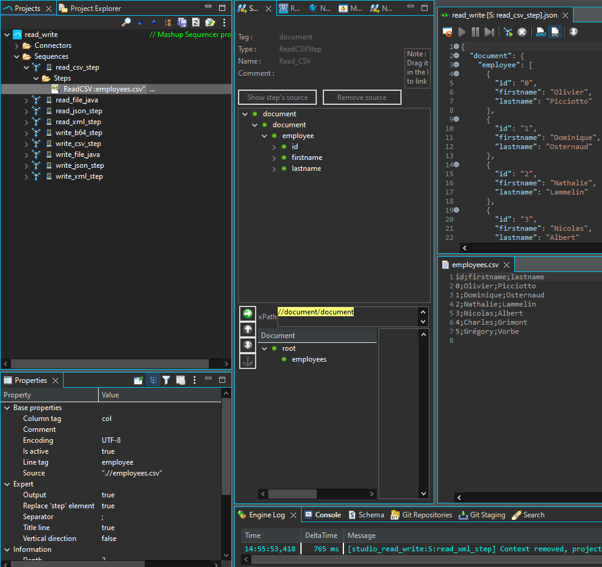

| Property | Description |
|----------|-------------|
| **Column tag**      |  Defines the columns tag name. Default value is **col**. Unused if **Title line** is set to **true**  |
| **Encoding**   | Set the **Encoding** property with a value for the charset encoding (ISO-8859-1, UTF-8, ...). |
| **Line tag**  |  Defines the lines tag name. Default value is **line**.  |
|   **Source**   |  This property is a Javascript field to fill with a file path. I can be an **absolute** path or a **relative** path using **./** (relative to the workspace folder) or **.//** (relative to the project folder)  |
|   **Separator**   |  Defines the CSV default separator symbol. Default value is **;**.  |
|   **Title line**   |  Defines whether the CSV file has a title line or not. If exists, the keys are named by the first title line of CSV file. Default value is **false**.   |
|    **Vertical direction**  |  Defines the array reading direction. Default value is **false** (horizontal) |

#### Write CSV Step

#### Read XML Step
#### Write XML Step

#### Write B64 Binary Step

#### Read Text file
#### Write Text file
### Understanding session management

#### Stateless programming

#### Stateful programming

### Understanding session management

A Session represents the relation between a Convertigo Server Client (Mobile App, Web App or API Consumer) to the Backend. Each time a client invokes a backend service a session is established. Sessions a kept in the Convertigo Server tables and represented as HTTP Cookies on the front side. If A Client provides the same Cookie he received from a previous backend service invocation in a new Service invocation, he will be attached to the same session.

Sessions enables Stateful programming having the Convertigo Server to hold some backend client data across multiple service invocations. This dose not mean that Stateful programming is mandatory, you can also be stateless by explicitly destroying sessions after each service invocation.

Sessions are automatically handled by Convertigo Server and are kept alive using the **HTTP session Timeout**  property in the project (See [Project](../../reference-manual/convertigo-objects/common/project) Object). If no requests come from a client for a given session after the Timeout, the session will be automatically closed.

#### Stateful programming

This is the default mode for Convertigo Applications. When a client invokes a service (Sequence), a session will be established between this client and the Convertigo server. All subsequent calls will be done within this same session.

One of the main usage of sessions are Authentication mechanisms. By default sessions are not Authenticated, preventing Sequences having having the **Authenticated context required** property set to **true** to run. At any time, If a Sequence calls the [SetAuthenticatedUser](../../reference-manual/convertigo-objects/sequencer/steps/http-session-management/set-authenticated-user) step, the session will be authenticated and any Sequence having the **Authenticated context required** property set to **true** will be allowed to run. 

As the the current Authenticated user is kept in the session, you can at any type use the [GetAuthenticatedUser](../../reference-manual/convertigo-objects/sequencer/steps/http-session-management/get-authenticated-user) step to retrieve the current authenticated user from the session. You can also use the the session steps to store and retrieve data from the session.

| Step | Description|
|------|------------|
|[GetFromSession](../../reference-manual/convertigo-objects/sequencer/steps/http-session-management/get-from-session) | Get A String from the current Session |
|[GetObjectFromSession](../../reference-manual/convertigo-objects/sequencer/steps/http-session-management/get-object-from-session) | Get a JavaScript Object from the current session |
|[SetInSession](../../reference-manual/convertigo-objects/sequencer/steps/http-session-management/set-in-session) | Set a String an the current session |
|[SetObjectInSession](../../reference-manual/convertigo-objects/sequencer/steps/http-session-management/set-object-in-session) | Set a JavaScript Object in the current session |

{{site.data.alerts.note}}
Sessions are use for Licensing control for Concurrent session licensing Schemes (B2C Licensing). Your Convertigo Server license will authorize a limited amount of sessions. Be sure to set your project's Session timeout to a reasonable amount to make sure they will be automatically closed on user inactivity. The Default is 30 minutes (1800 Seconds).
{{site.data.alerts.end}}

#### Stateless programming

Stateless programming is done by just closing the session explicitly after having executed a Sequence. In this case Convertigo server will not hold data across different service (Sequence) invocations. This is some time used in RESTful APIs contexts where the State is held on the client side. In this mode your Sequences must be authorized to run  un authenticated, so be sure the Sequences's **Authenticated context required** property are set to **false**.

Also you will be responsible for checking if the Sequence is allowed to to run in the business flow itself by checking a Token API key or whatever the client will provide you.

To explicitly close a session after a Sequence execution add as the last step a **RemoveSession** Step.

### Setting up FullSync on back-ends

#### Importing data to FullSync databases

#### Creating Views on data

#### Monitoring client data changes

### Miscellaneous backend steps

### Optionally expose Services as RESTful services

### Deploying & testing projects on Servers

### Debugging & Monitoring

#### Setting log levels

#### Adding custom logs
---
title: Backend Developers
keywords: pages, authoring, exclusion, frontmatter
last_updated: 02/04/2020
summary: "This chapter describes you how to use Convertigo backend objects to connect your data and build backend services."
sidebar: c8o_sidebar
permalink: /programming-guide/backend-developers/
---
This chapter describes you how to use Convertigo backend objects to connect your data.

## Connecting to Data

### Connect to Rest Web Services

Convertigo features the HTTP Connector able to connect and consume Rest API Web Services. 
To create a new REST project, click New > File > Project... > Convertigo Projects > **REST Empty Web service**. This template will do most of the work, but you can also manually create an HTTP Connector in any existing project by Right Click on project  > New > Connector > HTTP Connector. The Connector will be placed in the Connectors folder.


Choose a name wisely ;)


You have the possibility to give the HTTP connector a name


In next screen, set the address of the Rest Web Service to connect to. (Do not type http:// or https://) as this is automatically computed according to the SSL setting).


Last screen is a summary of all entered parameters for the Connector. Click **Finish**


The project is created in the Studio, in the **Projects** view


There are two ways of creating Connector and Transactions. If the Web Service has a YAML or JSWON openAPI definition (Swagger definition) you can import it and transactions will be automatically created or else you can manually set up the transactions.

#### __Manual transactions__

Right-click the Connector or its **Transactions** folder, then select New > Transaction


Depending on the target Rest Web Service choose the appropriate transaction type:
* **XML HTTP Transaction** will consume XML based REST Webservices (Data returned by the web services in XML format), mostly for XML/RPC type of web services
* **JSON HTTP Transaction** will consume jSON based REST Webservices (Data returned by the web services in jSON format), mostly for standard RESTful web services available today.
* **Download HTTP Transaction** will consume Binary based REST Webservices (Data returned by the web services in Binary format), mostly for downloading data in Binary format.
* **HTTP Transaction** will consume a REST based on unknown format. The data will be returned as raw data, you will have to parse by hand.


Give the transaction a name, add built-in and/or custom variables (they can be edited or added later). These variables will enable you to invoke the transactions with a given BODY, ContentType or any other POST or GET element in the HTTP Request.


Once the Transaction is created, you can right-click the transaction > Execute or press F5 key to execute transaction to test it and get results.

Also you can add a **Test Case** to it (Right Click o Transaction->New->Test Case) and set values in Variables to test your Transaction with a Given set of Input Variables. To set the value in a Variable, give the value in the **Default Value** Test Case variable's property.


#### __Importing REST WS schema__

Right-click your project > **Import REST WS reference**


Enter URL of the REST schema or browse a local file to import


API methods are automatically created as transactions of the corresponding type


You can easily create the **Call Transaction** Step by dragging and dropping the transaction a sequence with **CTRL key** (Windows) or **Command KEY** (Mac) pressed


To update transaction schema to be used in Sequence **Source picker**, execute the transaction at least once, right-click it and select **Update schema from current connector data**


Double-click your **Call Transaction** Step to refresh and display schema in the Source picker tab


### Connect to SOAP Web Services

Convertigo HTTP connector is able to connect to SOAP Web Services (XML messaging) through the import of a WSDL file or url.

To create a new SOAP project, click New > File > Project... > Convertigo Projects > **SOAP Web service**.


Give your project a name


Next screen will ask for an URL or a file to the distant SOAP Web Service WSDL.


The HTTP Connector is automatically created and named. **XML HTTP Transaction** are also automatically created and named by the SOAP method name and prefixed by a '**C**'


You can right-click the transaction > Execute or press F5 key to execute transaction to test it and get results. Left Panel is the Raw response of the WS and right panel is the XML or JSON response as seen in the transaction itself


You can test the other WS methods that require variable values using Test Cases.


You can easily create the **Call Transaction** Step by dragging and dropping the transaction a sequence with **CTRL key** (Windows) or **Command Key** (Mac) pressed


No need to update the transaction schema for the Sequence Source Picker, it was automatically created when the WSDL was imported.


In the Project Explorer view, you will see the SOAP templates in the **soap-templates** folder. This can be edited at your convinience (variable name, etc...).


### Connect to SQL Databases

The SQL Connector is able to connect to different Database Servers:  

| Supported Database   | Driver                                                           |
|----------------------|------------------------------------------------------------------|
| mySQL                | com.mysql.jdbc.Driver / com.mysql.cj.jdbc.Driver (V8+)           |
| MariaDB              | org.mariadb.jdbc.Driver                                          |
| Microsoft SQL Server | net.sourceforge.jtds.jdbc.Driver                                 |
| Oracle               | oracle.jdbc.driver.OracleDriver                                  |
| PostgreSQL           | org.postgresql.Driver                                            |
| HSQLDB               | org.hsqldb.jdbcDriver                                            |
| IBM DB2 on AS/400    | com.ibm.as400.access.AS400JDBCDriver                             |
| IBM DB2              | com.ibm.db2.jcc.DB2Driver                                        |  
| ODBC Bridge          | sun.jdbc.odbc.JdbcOdbcDriver                                     |


**JNDI** Database access is also available. In This case The database has to be referenced in the Application Server definition. This is only to be used in the case Convertigo Servers are deployed in J2EE Application Servers such as IBM WebSphere.

You can also add any other JDBC driver dynamically by adding the driver's **JAR** file in the **/libs** folder of your project. When you project will be deployed to the Convertigo server, it will be usable from your project. You will just have to know explicitly the driver URL to access it.

{{site.data.alerts.note}}
Some Drivers are not shipped with Convertigo due to license restrictions. You will have to provide them in the **/libs** directory of your project. This is the case for the Oracle Driver, the MYSQL Driver and the DB2 Drivers. Alternatively you can use the MariaDB driver instead of the MySQL driver for MySQL databases. This driver is 100% compatible and avoids licensing issues.
{{site.data.alerts.end}}

#### Create a SQL Connector based project
To create a new SQL project, click New > File > Project... > Convertigo Projects > **SQL project**


Choose a name for the project


You have the possibility to give the SQL connector a name


In next screen, choose the **JDBC driver** for your database connection and enter **JDBC URL** from proposed template. Fill in **Username** and **Password**, if needed. You can test the connection to the database using the **Test connection** button.


The project is created in the Studio, in the **Projects** view


To create a new SQL query, create a new SQL transaction. Right-click the Connector or its **Transactions** folder, then select New > Transaction


There is currently only one transaction type, choose **SQL transaction**


In the final wizard page, you have the possibility to write your SQL query. Enclose transaction variables (dynamic values) with brackets **{my_variable}**, this will also automatically creates the variables.


**my_id** transaction variable has been automatically created in the SQL transaction. Convertigo variables are String based variables. Some Database Servers need the data to be casted to the correct type (**::integer** for PostgreSQL query, for example)


If you double-click the SQL connector this will open a Tab with the Connector buttons and the transaction response data.  
If you haven't checked already, there is a button to test connection to your database.


Right-click the transaction > Execute or press F5 key to execute transaction and get result


If your transaction requires dynamic data, use Test cases as below


You can easily create the **Call Transaction** Step by dragging and dropping the transaction a sequence with CTRL key down


To update transaction schema to be used in Sequence **Source picker**, execute the transaction at least once, right-click it and select **Update schema from current connector data** or **Update schema from transaction definition**


Double-click your **Call Transaction** Step to refresh and display schema in the Source picker tab


### Connect to NoSQL Databases

### Connect to SAP NetWeaver Systems

### Understanding Data schemas

In Convertigo, all data coming from connectors are described by **Schemas**. This description is based on the XML Schema [https://www.w3schools.com/xml/schema_intro.asp](https://www.w3schools.com/xml/schema_intro.asp), and is automatically handled by Convertigo Studio. 

**Schemas** Can be displayed in the **Schema View**


By Default, Convertigo is not aware of the Structure (Schema) of data retrieved from a Connector, except when :

* The Connectors have been created from some Structured definition files (Import SOAP or REST YAML/JSON Swagger web Services)
* The Connector has been Created by importing SAP BAPI Transactions
  
The **Schemas** Are used in various parts  of Convertigo Studio and mainly in all **Source Pickers** to display the Structure of the data to bind from Step to Step or to bind from a Service to a FrontEnd UI.

This is why it is important to describe the Data Schema of Connector's transactions to Convertigo. This easy to do as Convertigo provides 2 commands to generate Schemas:

* Execute a Transaction to retrieve some data (F5 when the Transaction is selected), Right Click on a Transaction, and use the **Update Schema from Current Connector data**. This will use the current data displayed in the connector as model to generate a response Schema for this this Transaction. The response schema will be seen in the Schema view as **&lt;ConnectorName&gt;_&lt;TransactionName&gt;_ResponseData**.

    {{site.data.alerts.note}}
    Note that transaction's request data schemas are Automatically generated by Convertigo as &lt;ConnectorName&gt;_&lt;TransactionName&gt;_RequestData.
    {{site.data.alerts.end}}

* You can also use the **Update Schema from Transaction definition** command. This will only work on Connectors where Convertigo can introspect the underlying data models, for example SQL Connector transactions.

Once the **Schemas** are generated, you will be be able to explore all the data structures in the **Schema View** and to use them in the **Source Picker** (back end data binding) and the **Ngx Picker** (Front End data binding).

Note also that Schemas for **Sequences** are automatically generated by Convertigo by exploring the **Sequence** Data structure steps. You will find them in the **Schema** view as **&lt;SequenceName&gt;_RequestData** and **&lt;SequenceName&gt;_ResponseData**

## Building Backend Services

In Convertigo Back end services are called **Sequences** You can have as many **Sequences** in your projects, when called each Sequence will perform a backend flow executed on the Convertigo servers. Sequences can call Transactions to retrieve  or push data to connectors, perform data structure transformations and compute business logic.

Sequences building blocks are called **Steps**. Each step is executed one other the other in Sequence (This is why we call this a Sequence...). Some steps will build data structures (JSON and XML Steps), some will control the flow of execution (Flow Control Steps) and others will handle miscellaneous tasks like authentications, session management and others.

Sequences can have Input variables that will be used during the execution to provide data used for flow control or for pushing this data to connectors. In a Sequence all variables are Strings, as the connectors are responsible for typing the data to the correct format.

Sequences can call Connector's transactions and of course other Sequences (Sub Sequences) from the same project or from any other project in your workspace. This enables the concept of Sequences libraries projects providing sequences performing various tasks. By convention a library project is named as **lib_&lt;MyLibraryProject&gt;**

### Calling Transactions

One of the most commons tasks performed by a **Sequence** is to call a Connector's transaction. You can do this by using the [Call Transaction Step](../../reference-manual/convertigo-objects/sequencer/steps/convertigo-request-steps/call-transaction/)


A Sequence can call a transaction from its own project or form any Other project installed in your workspace. When executed the [Call Transaction Step](../../reference-manual/convertigo-objects/sequencer/steps/convertigo-request-steps/call-transaction/) Step will provide the data returned by the Connector as a **Source** to any other following step in the Sequence.

### Understanding the "Source" concept

**Sources** are a key concept in Convertigo. The basic idea is that each **Step** can provide data to the following steps in the execution flow. So, a given step can 'Source' some data from an other step previously executed.

The **Source Picker Tool** will display the data structure tree provided by a step when you right click on a step ->Show in Picker


If you want to link (We can also say 'Source') data provided by a step to an other Step, you will just have to Drag & Drop the wanted tree element **TXT** to the destination steps.

 

An other way to do this is to use the **Source** property of a Step and click on the [...] button to open source selector window.


Select the Step from where you want to 'Source' data from. (All Red Steps can not be sourced as they will be executed after your step) And pick in the tree data structure the **TXT** element you want to bind to your step.


#### XPath models

**XPaths** are a way to point to the data structure elements values we will want to source. This follows a standard syntax described [here](https://www.w3schools.com/xml/xpath_syntax.asp). In most cases, the source picker will generate for the you a Valid XPath so you do not have to bother so much about this. You can find below some very common XPath Use cases:

|XPath  sample | Usage |
|--------|-------|
|/data1/data2/data3/text() | Will select the **data3** node value if there is only one **data3** occurrence in the structure or all **data3** values (concatenated) if there are several occurrences of **data3** |
|/data1/data2/data3[1]/text() | Will select all the first **data3** occurrence value |
|/data1/data2/data3[@orginalKeyName = 'MyKey']/text() | Will select the **data3** occurrence having a attribute **'originalKeyname'** equal to **'MyKey'** |
|/data1//data4/text() | Will select all **data4** node values that are under the **data1** node whatever is their tree depth |

**XPaths** are a powerful selector tools to be able to 'Source' data from any structure

### Build logic flows

Sequences can have logic flows such as If/The/else decisions, Iterators and loop or Parallel executions. The execution is based on a graphic tree as follow :
* For **If** steps, every step under a If node will be executed if the If condition matches. If not the flow will continue to steps on the same level.
* For **If / Then / Else** steps, every step under the **Then** Step will be executed if the If condition matches. If not all the steps un the **Else** will be executed. At the end the flow will continue to steps on the same level.
* For **Iterators** and **loops** all steps under an **Iterator** Step will be executed repeatedly for each Iteration. When the iterations are finished the flow will continue to the step at the same level.
* For **Parallel** steps, Each step under a **Parallel** Step will be executed at the same time. The sequence will resume to the next Step at the same level when all the Steps finished their executions.


### Iterate on patterns

Sequences can use iterators or Loops Steps to perform several times step executions. The most used step for this is the [Iterator](../../reference-manual/convertigo-objects/sequencer/steps/flow-control-steps/iterator/) Step. The step's **source** property will be used to know on what occurrences the Iterator Step should loop. You can use the **Source Picker** to bind the Iterator's source to any previous step data structure holding multiple occurrences of data. for example if a **Call Transaction** Step returns this data structure :

```
{
    clients: [
        item: {
            id:"1",
            name:"test"
        },
        item: {
            id:"2",
            name:"test2"
        }
    ]
}
```

| XPath | Will Iterate on on |
|-------|---------------|
|/clients/item | All **item** objects in **clients** |
|/clients/item/name | All **name** of **item** objects in **clients** |
|//item | All **item** objects |
|/clients/item[contains(./name/text(), 'test')] | All **item** objects where the **name** field contains the 'text' string |

As you see you can use the full power of **XPath** expressions to fine tune your iteration patterns. If you remember, all Steps can be a 'Source' to other Steps. This is also true for the **Iterator** step. The step can be sourced to get current Iteration data.

This is why in any Step under an **Iterator** you can source it from the Iterator with a given XPath. for example if the Iterator iterates on **/clients/item** :

| XPath | data |
|-------|---------------|
|./id/text() | Will represent the **id** value of the current  iterated **item** in **clients** |
|./name/text() | Will represent the **name** value of the current  iterated **item** in **clients** |


### Understanding variables

Any Sequence in Convertigo can have input variables. These variables can be used all along the Sequence execution flow and passed to Subsequences or Transactions. Variables can be accessed within the Sequence in 2 ways :

* By Using the [Input Variables](../../reference-manual/convertigo-objects/sequencer/steps/others/input-variables/) step. This step is generally the  first step in a sequence and represents all the Input Variables of the sequence. Any other step can 'Source' a given variable from this step.
* The variable is also automatically inserted in the JavaScript scope of the Sequence. You can access it within any [SequenceJS](../..reference-manual/convertigo-objects/sequencer/steps/javascript-steps/sequence-js/) or within any **jXXXX** type of step such as [jIf](../../reference-manual/convertigo-objects/sequencer/steps/flow-control-steps/jif/) or [jDoWhile](../../reference-manual/convertigo-objects/sequencer/steps/flow-control-steps/jdowhile/)

Variables are not typed and are always considered as Strings. It is the Sequence (And Connector) responsibility to handle type conversions properly. For example if you a variable is passed to a SQL connector Transaction, be sure in the Transaction's SQL request to properly CAST this variable to match a give SQL table column type.

Sequences variables will also appear in the Front End builder as [CallSequence](../../reference-manual/convertigo-objects/mobile-application/components/action-components/callsequence/) Variables you will be able to bind to UI components.

### Compute data & business logic

#### Integrating JavaScript code
To write JavaScript code in a Sequence use the **Sequence JS** step. There is completion for some standard JS objects and functions.


Once a JavaScript variable is declared, it is available in all JS Steps of the Sequence.
Variables of a sequence are automatically added to the JavaScript scope of the Sequence and are available as Strings by their name.  

JavaScript variables can come from JS Steps too (JSimpleSource, etc...) and are accessible in a Sequence JS step where they can be modified. You can also access JS variables and modify them directly in a jElement Step, for example, in the '**Expression**' property of the Step, but this is a one line editor. For longer script, use preferably a **Sequence JS** step.


##### Calling some java code

To write Java invocation code in a Sequence use the **Sequence JS** step. You will just have to write the full package name to reference the Java class. For the standard JDK classes there is completion for the classes and methods.


##### Using third party java libraries

To use external Java libraries, copy the classes or JAR files in a folder called '**libs**' in your project. Then, write your Java invocation code in a **Sequence JS** step. There will be no completion though. You will just have to write the full package name prefixed with the word '**Packages**'.


Often, to display and use properly variables data, you will have to convert them to Strings. To do so, just add an empty string to it (empty double quotes).


##### Using third party JavaScript libraries

To use an external JS library, copy the JS file in your project and in a **Sequence JS** Step use function '**include("<path_to_js_file>")**' to load file. This will automatically eval script in the Sequence JS scope and you can use it in a **Sequence JS** Step or in **JS element** Steps.


### Reading & Writing data files
Convertigo has different Steps to Read or Write data files from different formats (XML, CSV, JSON). You can also write your own data file reader/writer in a Sequence JS step using Java.

#### Read JSON Step
Use the [Read JSON](../../reference-manual/convertigo-objects/sequencer/steps/file-management-steps/read-json/) Step to load data from a JSON file.


| Property | Description |
|----------|-------------|
| **Key**      | Fill this property with a value for the parent object. |
| **Source**   | This property is a Javascript field to fill with a file path. I can be an **absolute** path or a **relative** path using **./** (relative to the workspace folder) or **.//** (relative to the project folder) |

#### Write JSON Step
Use the [Write JSON](../../reference-manual/convertigo-objects/sequencer/steps/file-management-steps/write-json/) Step to write data to a JSON file.


| Property | Description |
|----------|-------------|
| **Encoding**      | Set the **Encoding** property with a value for the charset encoding (ISO-8859-1, UTF-8, ...). |
|   **Output file**     | This property is a Javascript field to fill with a file path. I can be an **absolute** path or a **relative** path using **./** (relative to the workspace folder) or **.//** (relative to the project folder) |


#### Read CSV Step
Use the [Read CSV](../../reference-manual/convertigo-objects/sequencer/steps/file-management-steps/read-csv/) Step to load data from a CSV file.


| Property | Description |
|----------|-------------|
| **Column tag**      |  Defines the columns tag name. Default value is **col**. Unused if **Title line** is set to **true**  |
| **Encoding**   | Set the **Encoding** property with a value for the charset encoding (ISO-8859-1, UTF-8, ...). |
| **Line tag**  |  Defines the lines tag name. Default value is **line**.  |
|   **Source**   |  This property is a Javascript field to fill with a file path. I can be an **absolute** path or a **relative** path using **./** (relative to the workspace folder) or **.//** (relative to the project folder)  |
|   **Separator**   |  Defines the CSV default separator symbol. Default value is **;**.  |
|   **Title line**   |  Defines whether the CSV file has a title line or not. If exists, the keys are named by the first title line of CSV file. Default value is **false**.   |
|    **Vertical direction**  |  Defines the array reading direction. Default value is **false** (horizontal) |

#### Write CSV Step

#### Read XML Step
#### Write XML Step

#### Write B64 Binary Step

#### Read Text file
#### Write Text file

### Understanding session management

A Session represents the relation between a Convertigo Server Client (Mobile App, Web App or API Consumer) to the Backend. Each time a client invokes a backend service a session is established. Sessions a kept in the Convertigo Server tables and represented as HTTP Cookies on the front side. If A Client provides the same Cookie he received from a previous backend service invocation in a new Service invocation, he will be attached to the same session.

Sessions enables Stateful programming having the Convertigo Server to hold some backend client data across multiple service invocations. This dose not mean that Stateful programming is mandatory, you can also be stateless by explicitly destroying sessions after each service invocation.

Sessions are automatically handled by Convertigo Server and are kept alive using the **HTTP session Timeout**  property in the project (See [Project](../../reference-manual/convertigo-objects/common/project) Object). If no requests come from a client for a given session after the Timeout, the session will be automatically closed.

#### Stateful programming

This is the default mode for Convertigo Applications. When a client invokes a service (Sequence), a session will be established between this client and the Convertigo server. All subsequent calls will be done within this same session.

One of the main usage of sessions are Authentication mechanisms. By default sessions are not Authenticated, preventing Sequences having having the **Authenticated context required** property set to **true** to run. At any time, If a Sequence calls the [SetAuthenticatedUser](../../reference-manual/convertigo-objects/sequencer/steps/http-session-management/set-authenticated-user) step, the session will be authenticated and any Sequence having the **Authenticated context required** property set to **true** will be allowed to run. 

As the the current Authenticated user is kept in the session, you can at any type use the [GetAuthenticatedUser](../../reference-manual/convertigo-objects/sequencer/steps/http-session-management/get-authenticated-user) step to retrieve the current authenticated user from the session. You can also use the the session steps to store and retrieve data from the session.

| Step | Description|
|------|------------|
|[GetFromSession](../../reference-manual/convertigo-objects/sequencer/steps/http-session-management/get-from-session) | Get A String from the current Session |
|[GetObjectFromSession](../../reference-manual/convertigo-objects/sequencer/steps/http-session-management/get-object-from-session) | Get a JavaScript Object from the current session |
|[SetInSession](../../reference-manual/convertigo-objects/sequencer/steps/http-session-management/set-in-session) | Set a String an the current session |
|[SetObjectInSession](../../reference-manual/convertigo-objects/sequencer/steps/http-session-management/set-object-in-session) | Set a JavaScript Object in the current session |

{{site.data.alerts.note}}
Sessions are use for Licensing control for Concurrent session licensing Schemes (B2C Licensing). Your Convertigo Server license will authorize a limited amount of sessions. Be sure to set your project's Session timeout to a reasonable amount to make sure they will be automatically closed on user inactivity. The Default is 30 minutes (1800 Seconds).
{{site.data.alerts.end}}

#### Stateless programming

Stateless programming is done by just closing the session explicitly after having executed a Sequence. In this case Convertigo server will not hold data across different service (Sequence) invocations. This is some time used in RESTful APIs contexts where the State is held on the client side. In this mode your Sequences must be authorized to run  un authenticated, so be sure the Sequences's **Authenticated context required** property are set to **false**.

Also you will be responsible for checking if the Sequence is allowed to to run in the business flow itself by checking a Token API key or whatever the client will provide you.

To explicitly close a session after a Sequence execution add as the last step a **RemoveSession** Step.

### Setting up FullSync on back-ends

#### Importing data to FullSync databases

#### Creating Views on data

#### Monitoring client data changes

### Miscellaneous backend steps

### Optionally expose Services as RESTful services

### Deploying & testing projects on Servers

### Debugging & Monitoring

#### Setting log levels

#### Adding custom logs
