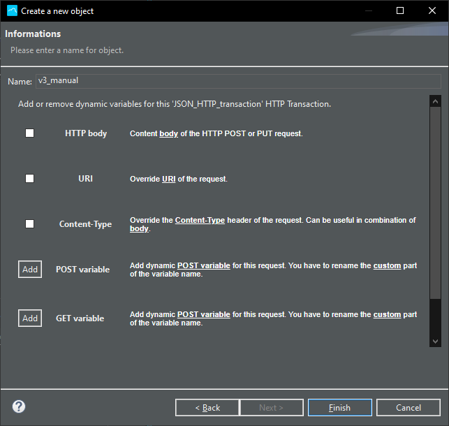
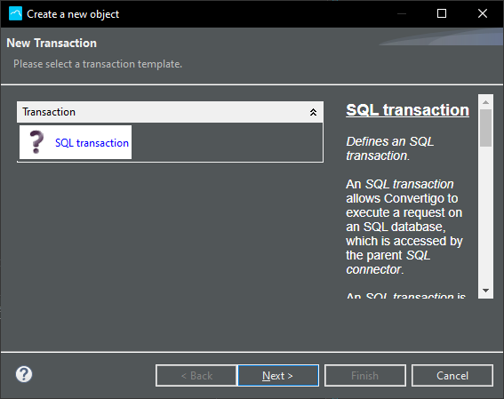

This chapter describes you how to use Convertigo backend objects to connect your data.

## Connecting to Data

### Connect to Rest Web Services

Convertigo features the HTTP Connector able to connect and consume Rest API Web Services. 
To create a new REST project, click New->File->Project...->Convertigo Projects->**REST Empty Web service** . This template will most of the work, but you can also manually create an HTTP Connector in any existing project by Right Click on project ->New->Connector->HTTP Connector. The Connector will be placed in the Connectors folder.

Choose a name wisely ;)

You have the possibility to give the HTTP connector a name

In next screen, set the address of the Rest Web Service to connect to. (Do not type http:// or https://) as this is automatically computed according to the SSL setting).

Last screen is a summary of all entered parameters for the Connector. Click **Finish**

The project is created in the Studio, in the **Projects** view

There are two ways of creating the transactions in the Connector. If the Web Service has a yaml or json schema you can import it and transactions will be automatically created or else you can manually set up the transactions.

#### __Manual transactions__

Right-click the Connector or its **Transactions** folder, then select New > Transaction

Depending on the target Rest Web Service choose the appropriate transaction type:
* **XML HTTP Transaction** will consume XML based REST Webservices (Data returned by the web services in XML format), mostly for XML/RPC type of web services
* **JSON HTTP Transaction** will consume jSON based REST Webservices (Data returned by the web services in jSON format), mostly for standard RESTful web services available today.
* **Download HTTP Transaction** will consume Binary based REST Webservices (Data returned by the web services in Binary format), mostly for downloading data in Binary format.
* **HTTP Transaction** will consume a REST based on unknown format. The data will be returned as raw data, you will have to parse by hand.

Give the transaction a name, add built-in and/or custom variables (they can be edited or added later). These variables will enable you to invoke the transactions with a given BODY, ContentType or any other POST or GET element in the HTTP Request.

Once the Transaction is created, you can right-click the transaction > Execute or press F5 key to execute transaction to test it and get results.

Also you can add a **Test Case** to it (Right Click o Transaction->New->Test Case) and set values in Variables to test your Transaction with a Given set of Input Variables. To set the value in a Variable, give the value in the **Default Value** Test Case variable's property.

#### __Importing REST WS schema__

Right-click your project > **Import REST WS reference**

Enter URL of the REST schema or browse a local file to import

API methods are automatically created as transactions of the corresponding type

You can easily create the **Call Transaction** Step by dragging and dropping the transaction a sequence with CTRL key down

To update transaction schema to be used in Sequence **Source picker**, execute the transaction at least once, right-click it and select **Update schema from current connector data**

Double-click your **Call Transaction** Step to refresh and display schema in the Source picker tab

### Connect to SOAP Web Services

### Connect to SQL Databases

The SQL Connector is capable to connect to multiple SGBD.  
| Supported SGBD       | Driver                                                           |
|----------------------|------------------------------------------------------------------|
| mySQL                | com.mysql.jdbc.Driver / com.mysql.cj.jdbc.Driver (8+)            |
| MariaDB              | org.mariadb.jdbc.Driver                                          |
| Microsoft SQL Server | net.sourceforge.jtds.jdbc.Driver                                 |
| Oracle               | oracle.jdbc.driver.OracleDriver                                  |
| PostgreSQL           | org.postgresql.Driver                                            |
| HSQLDB               | org.hsqldb.jdbcDriver                                            |
| DB2                  | com.ibm.db2.jcc.DB2Driver / com.ibm.as400.access.AS400JDBCDriver |
| ODBC Bridge          | sun.jdbc.odbc.JdbcOdbcDriver                                     |

**JNDI** Database access is also available.

To create a new SQL project, click New > File > Project... > Convertigo Projects > **SQL project**

Choose a name for the project

You have the possibility to give the SQL connector a name

In next screen, choose the **JDBC driver** for your database connection and enter **JDBC URL** from proposed template. Fill in **Username** and **Password**, if needed. You can test the connection to the database using the **Test connection** button.

The project is created in the Studio, in the **Projects** view

To create a new SQL query, create a new SQL transaction. Right-click the Connector or its **Transactions** folder, then select New > Transaction

There is currently only one transaction type, choose **SQL transaction**

In the final wizard page, you have the possibility to write your SQL query. Enclose transaction variables (dynamic values) with brackets **{my_variable}**, this will also automatically creates the variables.

**my_id** transaction variable has been automatically created in the SQL transaction. Convertigo variables are String based variables. Some SGBD need the data to be cast to the correct type (**::integer** for PostgreSQL query, for example)

If you double-clic the SQL connector this will open a Tab with the Connector buttons and the transaction response data.  
If you haven't checked already, there is a button to test connection to your database.

Right-click the transaction > Execute or press F5 key to execute transaction and get result

If your transaction requires dynamic data, use Test cases as below

You can easily create the **Call Transaction** Step by dragging and dropping the transaction a sequence with CTRL key down

To update transaction schema to be used in Sequence **Source picker**, execute the transaction at least once, right-click it and select **Update schema from current connector data**

Double-click your **Call Transaction** Step to refresh and display schema in the Source picker tab

### Connect to NoSQL Databases

### Connect to SAP Netweaver Systems

### Understanding data models & schemas

## Building Backend Services

### Calling Transactions

### Understanding the "Source" concept

#### Xpath models

### Build logic flows

### Iterate on patterns

### Understanding variables

### Compute data & business logic

#### Integrating Javascript code

##### Calling some java code

##### Using third party java libraries

##### Using third party Javascript libraries

### Reading & Writing data files

### Understanding session management

#### Stateless programming

#### Stateful programming

### Setting up FullSync on back-ends

#### Importing data to FullSync databases

#### Creating Views on data

#### Monitoring client data changes

### Miscellaneous backend steps

### Optionally expose Services as RESTful services

### Deploying & testing projects on Servers

### Debugging & Monitoring

#### Setting log levels

#### Adding custom logs
