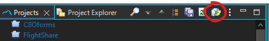
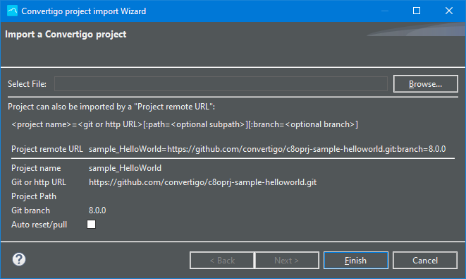
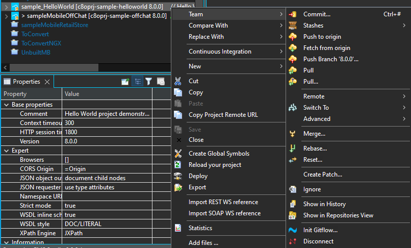
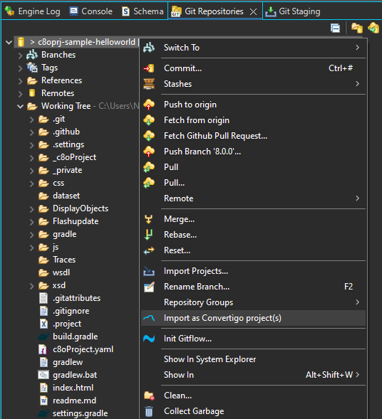
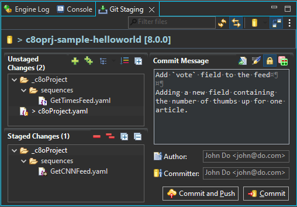
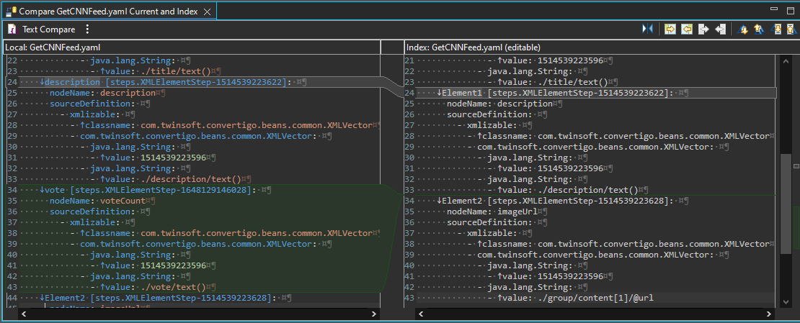

Convertigo Platform enables collaborative development and DevOps operations using Continuous Integration techniques. DevOps is usually a set of tasks that can be described this way :

__ __Coding__ : code development and review, source code management tools, code merging.
  
  Convertigo enables coding using Low Code technologies. You can have more information on collaborative development & source control / code merging [here](#collaborative_development).
__ __Building__ : continuous integration tools, build status.

  On Convertigo platform building can be made manually or using Continuous integration tools. More information on this [here](#integrating_in_ci).
__ __Testing__ : continuous testing tools that provide quick and timely feedback on business risks
__ __Packaging__ : artifact repository, application pre-deployment staging. 
  
  On Convertigo platform application packaging is done using the .CAR (Convertigo ARchive) format. This can be done manually by simply exporting a project from studio , or using Continuous Integration. see [here](#integrating_in_ci).
__ __Releasing__ : change management, release approvals, release automation.

    On Convertigo platform, release is simply done by deploying projects on a Convertigo server. This can be done manually using the studio's deploy menu or by using Continuous Integration as described [here](#integrating_in_ci).
__ __Configuring__ : infrastructure configuration and management, infrastructure as code tools.

    On Convertigo platform, configuration and environment settings is done via the Administration console. More information on this [here](../../operating-guide/using-convertigo-administration-console).

__ __Monitoring__ : applications performance monitoring, end-user experience

    On Convertigo platform, performance monitoring is done via the Administration console. More information on this [here](../../operating-guide/using-convertigo-administration-console).

## Collaborative development
Convertigo Platform host Application and API describes in Convertigo projects.

Projects are isolated folder containing Low Code objects descriptions and application resources.

Low Code objects descriptions are based on YAML format: it's human readable and VCS friendly. The Studio is shipped with a Git plugin, the most used VCS today.

### Importing git projects
You can retrieve a Convertigo with any standard git client.

This is the way to import a project using a git url. We consider the project starts at the git repository root.

The simplest way is to use the Import project button form the Project view toolbar:

This wizard __Clone and Import__ at once:

The __Project name__ have to be knowed. __Git or http URL__ can be a `git://` or a `http(s)://` URL of the repository.

The __Project Path__ is needed if the Convertigo project isn't at the repository root, to specify its sub folder.

The __Git branch__ allows to specify the branch to clone. If not specified, the default repository branch is used.

The __Project remote URL__ is the contraction of all previous settings in one String and can be used to be shared easily.

Once the __Finish__ button pressed, the repository is automaticaly cloned into <workspace>/git/<repo name> and imported as a Convertigo project.

The project is linked to the repository. You can see it thanks the project icone decoration and all options available inside the __Team__ menu:

Another way is to use the __Git Repository View__ to import an existing local repository or clone a remote one.

Once a repository containing Convertigo project(s) in the view, you can right click to __Import as Convertigo project(s)__:

### Using the Staging & Commit views

After modification done and saved in your Convertigo project, the __Git Staging view__ shows current modifications. Files with `?` are new, with `>` are modified and with `x` are deleted.

The __unstaged__ part contains modified files since the last local repository state. They have to be reviewed and moved to the __Staged Changes__ part, using drag-n-drop or menu.

The __Staged Changes__ part contains file changes ready to be commited to the local repository.

Using menu or double-click, you can compare changes for a given file, with a side-by-side comparator. Convertigo objects properties are human readable in the YAML format and you can check your change is really here:

Once all needed files validated in the __Staged Changes__ part and comment added, you can Commit (local) and eventually Push (to remote) your modifications.

Take care to stage the `c8oProject.yaml` and other `yaml` listed because they refer each other. If you miss it, you could commit orphean code.

### Sharing git project

If you start a new project or have an existing one, you can share it with git using the Convertigo Studio.

## Setting up gradle tasks

## Integrating in CI

## Building iOS & Android apps

## Deploying apps on Stores
