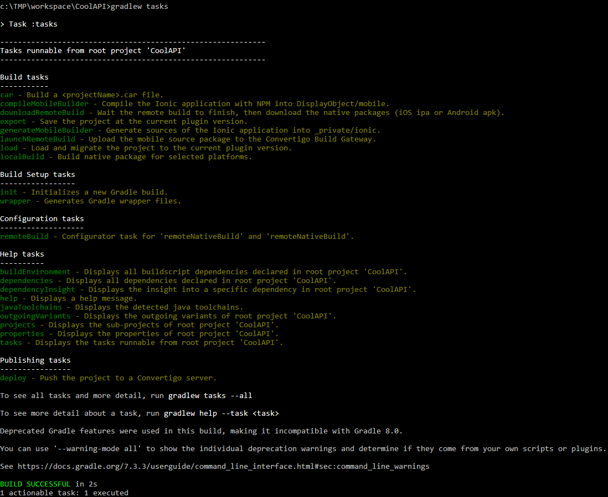

Convertigo Platform enables collaborative development and DevOps operations using Continuous Integration techniques. DevOps is usually a set of tasks that can be described this way :
 
__Coding__ : code development and review, source code management tools, code merging.
 
Convertigo enables coding using Low Code technologies. You can have more information on collaborative development & source control / code merging [here](#collaborative_development).
 
__Building__ : continuous integration tools, build status.
 
On Convertigo platform building can be made manually or using Continuous integration tools. More information on this [here](#integrating_in_ci).
 
__Testing__ : continuous testing tools that provide quick and timely feedback on business risks
 
__Packaging__ : artifact repository, application pre-deployment staging. 
 
On Convertigo platform application packaging is done using the .CAR (Convertigo ARchive) format. This can be done manually by simply exporting a project from studio , or using Continuous Integration. see [here](#integrating_in_ci).
 
__Releasing__ : change management, release approvals, release automation.
 
On Convertigo platform, release is simply done by deploying projects on a Convertigo server. This can be done manually using the studio's deploy menu or by using Continuous Integration as described [here](#integrating_in_ci).
 
__Configuring__ : infrastructure configuration and management, infrastructure as code tools.
 
On Convertigo platform, configuration and environment settings is done via the Administration console. More information on this [here](../../operating-guide/using-convertigo-administration-console).
 
__Monitoring__ : applications performance monitoring, end-user experience
 
On Convertigo platform, performance monitoring is done via the Administration console. More information on this [here](../../operating-guide/using-convertigo-administration-console).
 
## Collaborative development
Convertigo Platform host Application and API describes in Convertigo projects.
 
Projects are isolated folder containing Low Code objects descriptions and application resources.
 
Low Code objects descriptions are based on YAML format: it's human readable and VCS friendly. The Studio is shipped with a Git plugin, the most used VCS today.
 
### Importing git projects
You can retrieve a Convertigo project with any standard git client.
 
This is the way to import a project using a git URL. We consider the project starts at the git repository root.
 
The simplest way is to use the Import project button form the Project view toolbar:
 

 
This wizard __Clone and Import__ at once:
 

 
* The __Project name__ have to be known. If you do not know this name, you can view the **c8oProject.yaml** file in the Git Repository and look at the head of the file:
```
↑convertigo: 8.0.0.m006
↓projectName [core.Project]: 
```
The project name is at the 2nd line, in this case 'projectName'
 
* __Git or http URL__ can be a `git://` or a `http(s)://` URL of the repository.
* The __Project Path__ is needed if the Convertigo project isn't at the repository root, to specify its sub folder.
* The __Git branch__ allows to specify the branch to clone. If not specified, the default repository branch is used.
* The __Project remote URL__ is the contraction of all previous settings in one String and can be used to be shared easily.
 
Once the __Finish__ button pressed, the repository is automatically cloned into <workspace>/git/<repo name> and imported as a Convertigo project.
 
The project is linked to the repository. You can see it thanks the project icon decoration and all options available inside the __Team__ menu:
 

 
### Using the Staging & Commit views
 
After modification done and saved in your Convertigo project, the __Git Staging view__ shows current modifications. Files with `?` are new, with `>` are modified and with `x` are deleted.
 
* The __unstaged__ part contains modified files since the last local repository state. They have to be reviewed and moved to the __Staged Changes__ part, using drag-n-drop or menu.
 
* The __Staged Changes__ part contains file changes ready to be committed to the local repository.
 

 
Using menu or double-click, you can compare changes for a given file, with a side-by-side comparator. Convertigo objects properties are human readable in the YAML format and you can check your change is really here:
 

 
Once all needed files validated in the __Staged Changes__ part and comment added, you can Commit (local) and eventually Push (to remote) your modifications.
 
Take care to stage the `c8oProject.yaml` and other `yaml` listed because they refer each other. If you miss it, you could commit orphan code.
 
Don't forget, a commit is local and have to be pushed to the remote git repository, so use the __Push__ button or the option from the project menu.
 
### Sharing git project
 
If you start a new project or have an existing one, you can share it with git using the Convertigo Studio.
 
First, you have to create a local repository. Open the right-click menu on your project and select __Team > Share Project...__.
 

 
A wizard opens. You have to check __Use or create repository in parent folder of project__, focus your project bellow then press the __Create Repository__ button and finally the __Finish__ button.
 

 
Your are ready for the initial commit. Write a comment and stage all your project files. A recommended `.gitignore` is ready to skip unnecessary files and folders.
 

 
Before pushing your project, you have to create a git repository (github, bitbucket, gitlab ...) and copy the URL to your clipboard.
 
Click the __Commit and Push__ button. The next wizard read the clipboard to initialize the git URL.
 

 
Click __Preview >__ button and follow the wizard to the end. If successful, you can Fetch/Push your project with that remote repository.
 
## Setting up gradle tasks
 
To enable __Continuious Integration__ build, you have to add __Gradle__ resources to your Convertigo project. Gradle is a tool use to build and to perform some tasks.
 
To integrate configuration files, do a right click on your project and inside the __Continuous Integration__ menu you can choose Gradle files only, or also add configuration for GitHub Actions or CircleCI.
 

 
You can see Gradle files in the __Project Explorer__ view:
 

 
The `build.gradle` file is the key file to open. It's self documented, with available options to be edited or used as command line arguments. [See the online full version](https://github.com/convertigo/convertigo-common-resources/blob/8.0.0/gradle/build.gradle):
 

 
The project also contains `gradlew`. This is a standalone version of Gradle ready to use in your project.
 
It's only need Java to be configured in your shell. It can be invocated in Window, Linux or MacOS.
 
Here the command to list all available tasks:
 

 
## Integrating in CI
 
Thanks to the __Continuious Integration__ menu on a project, you can load template CI configuration for __GitHub Actions__ or __CircleCI__.
 
### GitHub Actions
 
__GitHub Actions__ is the CI integrated with GitHub and share the same administration interface. Of course your git repository must be on GitHub. 
 
Once __Update GitHub Actions and Gradle__ from the __Continuious Integration__ menu, the `.github/workflows/main.yml` file is created.
 
It can be edited from the __Project Explorer__ view but it can be hidden the first time. You have to remove the filter to see file or folder starting with a dot.
 
Reveal the `.github` folder using the 3-dots menu and `Filters and Customization...` and uncheck the `.* resources` entry.
 
Now you can open and edit the `.github/workflows/main.yml` configuration file. [See the online full version](https://github.com/convertigo/convertigo-common-resources/blob/8.0.0/github-actions/main.yml):
 

 
The file is self documented and must be edited.
 
Instead of putting your secrets like password in this file, you should configure them on your GitHub interface. See GitHub documentation about secrets [here](https://docs.github.com/en/actions/security-guides/encrypted-secrets).
 
### CircleCI
 
__CircleCI__ is a popular CI. It can be configured with many git repositories. 
 
Once __Update CircleCI and Gradle__ from the __Continuious Integration__ menu, the `.circleci/config.yml` file is created.
 
It can be edited from the __Project Explorer__ view but it can be hidden the first time. You have to remove the filter to see file or folder starting with a dot.
 
Reveal the `.github` folder using the 3-dots menu and `Filters and Customization...` and uncheck the `.* resources` entry.
 
Now you can open and edit the `.circleci/config.yml` configuration file. [See the online full version](https://github.com/convertigo/convertigo-common-resources/blob/8.0.0/circleci/config.yml):
 

 
The file is self documented and must be edited.
 
Instead of put your secrets like password in the file, you should configure them on your CircleCI interface.
 
### Other Continuous CI/CD Pipelines
 
This mechanism can apply to any other CI/CD platform such as Jenkins, AzurePipelines etc... They all work by using a configuration file you can add to you project. Read documentation about the CI/CD platform you wan to use to create this file and use the Convertigo Gradle commands to perform the tasks you need.
 
## Building iOS & Android apps
 
If your project is configured with Gradle, it's ready to build native mobile applications. The target Gradle task is __localBuild__.
 
Your project must have one or many __Platforms__ objects declared. New mobile projects are configured with an __Android__ and an __iOS__ platform:
 

 
Mobile builds are __Cordova__ based. Each platforms have its configuration file that can be see through the __Project Explorer__ view: `DisplayObjects/platforms/<platform name>/config.xml`.
 
All platforms can be built except iOS based platforms on a non-MacOS build host. You can restrict which platform to build using the __-Pconvertigo.localBuild.platforms__ parameter or edit the value in the __build.gradle__:
 
```
gradlew localBuild -Pconvertigo.localBuild.platforms=[Android]
```
 
### Android build
 
The default build mode is __debug__ and doesn't need signing configuration.
 
If you need a __release__ build, enable this mode in the __build.gradle__ or add the `-Pconvertigo.localBuild.mode=release`. You also have to configure your signing key.
 
You can use __Android Studio__ to [generate your signing key](https://developer.android.com/studio/publish/app-signing#generate-key).
 
You will obtain a `.keystore` file, with a __keystore password__, a certificate __alias__ and a certificate __password__.
 
All can be added to your __build.gradle__ but for security reason, we recommand to add them to __gradlew__ parameters and use secrets of your CI:
 
```
gradlew localBuild -Pconvertigo.localBuild.mode=release \
  -Pconvertigo.localBuild.androidKeystore=android.keystore \
  -Pconvertigo.localBuild.androidKeystorePassword=$ANDROID_KS_PASSWORD \
  -Pconvertigo.localBuild.androidAlias=MyAlias \
  -Pconvertigo.localBuild.androidPassword=$ANDROID_PASSWORD
```
 
### iOS build
 
The default build mode is __debug__ and you have to configure your signing key.
 
If you need a __release__ build, enable this mode in the __build.gradle__ or add the `-Pconvertigo.localBuild.mode=release`. You also have to configure your signing key.
 
Mac OS code signing must be configured for your CI. [Configure Application signing with GitHub Actions](https://developer.android.com/studio/publish/app-signing#generate-key).
 
Once configured, you have to configure __Provisioning Profile__ file path and the __ iOS Sign Identity__.
 
```
gradlew localBuild -Pconvertigo.localBuild.mode=release \
  -Pconvertigo.localBuild.iosProvisioningProfile=ios.mobileprovision \
  -Pconvertigo.localBuild.iosSignIdentity="iPhone Developer"
```
 
 
