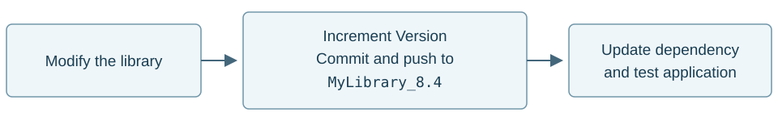
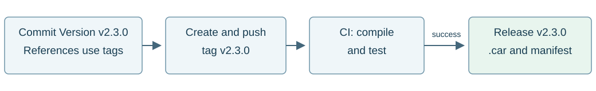

This guide recommends naming and publishing conventions. Convertigo itself allows a free-form [project Version property](../../../reference-manual/convertigo-objects/common/project/).

> **Guiding principle:** reference branches during development; reference immutable tags when releasing a version.

A **release** publishes a validated version with its archives and release notes. A **Git tag** identifies the commit containing that version's sources and dependency references.

## References and development branches

A **Convertigo project reference** declares a dependency on another project. For Git dependencies, it specifies the project name, repository and revision to load. The `branch` parameter can select either a branch or a tag.

Maintain one library branch per Convertigo compatibility line, such as `MyLibrary_8.3` and `MyLibrary_8.4`. This allows maintenance of the 8.3 line while evolving the 8.4 line. Tests must confirm compatibility, including when upgrading Convertigo.

On its development branch, the application references compatible library branches so the team can retrieve updates and test their integration throughout development.

## Library and application versions

**Prefix versions with `v`**, both in the Convertigo project's **Version** property and in Git tags: `v2.3.0`, `v8.4.0.12`. Branch names retain their compatibility suffix, such as `_8.4`.

For libraries, use `v<ConvertigoTarget>.<Revision>`: in `v8.4.0.12`, `8.4.0` is the technical target and `12` is the library revision. For each integrated change, increment the revision in the **Version** property and commit it: `v8.4.0.12` → `v8.4.0.13`. Each published version receives a distinct tag; intermediate changes remain available through the branch.

This four-number format is not Semantic Versioning. A breaking change requires documented migration steps and tests in consuming applications; an increment alone does not guarantee compatibility.

Also update application versions, including when only dependency references change. Before tagging, check that **Version** exactly matches the intended tag. An unchanged library keeps its existing tag.

## Release through continuous integration

**Prerequisite: configure continuous integration (CI) to run when tags matching `v*` are pushed**, using the [Convertigo Gradle and CI resources](../#setting-up-gradle-tasks). Creating a local tag alone does not publish a release.

Replace branch references with validated tags, including indirect dependencies and templates: the entire dependency graph must be pinned.

1. Pin the dependencies of modified libraries, update their **Version** property and commit. Create and push their tags, then wait for successful CI releases. Reuse existing tags for unchanged libraries.
2. In the application, select these tags, update **Version** and commit the complete state.
3. Create and push the application tag. Configure CI to check versions and references, compile, test and generate the `.car` archives. Publish the release only after successful checks, with release notes and a dependency manifest.
4. Resume development in a new commit that restores references to branches, without changing the published tag.

**Deliver the `.car` archives produced by CI**, rather than manual Studio exports, to establish their provenance from the tagged commit.

## Governance rules

- Published tags are immutable: never move, replace or delete them.
- Retain sources, tags, archives, build-tool versions, validated Convertigo Studio/Server versions and the complete dependency manifest to allow reconstruction.
- Promote validated archives between environments when their configuration allows it.
- Start a hotfix from the affected tag and publish a new release; only modified libraries require new tags.

## Example: PortailRH release v2.3.0

The fictional `PortailRH` application uses `lib_RH` (backend services) and `lib_UI_RH` (UI components) on Convertigo 8.4. Each project has its own Git repository.

| Project | Development branch | Release version and tag |
|---|---|---|
| `PortailRH` | `develop` | `v2.3.0` |
| `lib_RH` | `lib_RH_8.4` | `v8.4.0.13`, correcting `v8.4.0.12` |
| `lib_UI_RH` | `lib_UI_RH_8.4` | Existing `v8.4.0.7`, unchanged library |

After CI publishes `lib_RH v8.4.0.13`, `PortailRH` replaces `:branch=lib_RH_8.4` with `:branch=v8.4.0.13` and references tag `v8.4.0.7` of `lib_UI_RH`.

The team sets the **Version** property of `PortailRH` to `v2.3.0`, commits, then creates and pushes that tag. CI publishes the release and its `.car` archives. Development can resume with branch references: checking out `v2.3.0` still retrieves the pinned references above. Load the referenced dependencies to restore the complete project set.
